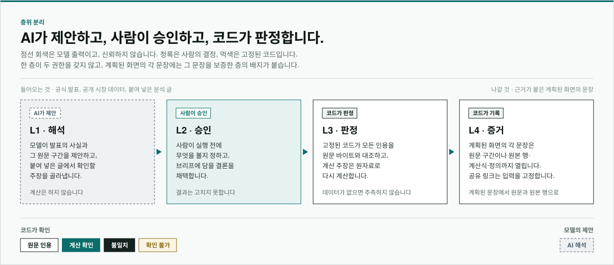
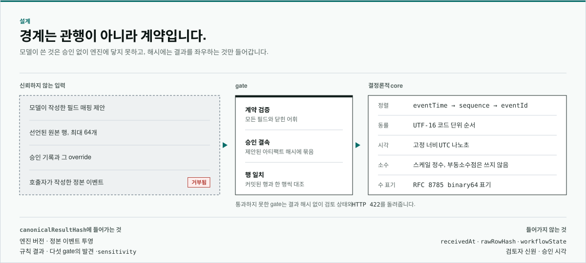

<!-- markdownlint-disable-file MD033 MD041 -->

  

<h1 align="center">WeaveTrail</h1>

  공식 발표와 공개 데이터로, 시장에서 일어난 일을 근거와 함께.

  
  
  

  <a href="https://weave-trail-web-flax.vercel.app"><b>서비스 열기</b></a>
  &middot;
  <a href="README.md">English</a>

  영문 문서가 기준입니다.

  <a href="#요약은-아직-근거가-아닙니다">문제</a> &middot;
  <a href="#실제-사례">실제 사례</a> &middot;
  <a href="#층위-분리">층위</a> &middot;
  <a href="#경계는-관행이-아니라-계약입니다">설계</a> &middot;
  <a href="#어떻게-맞물리나">구성</a>

시장에서 일이 생기면 두 종류의 글이 뒤따릅니다. 감독기관의 공식 발표는 정확하지만
흩어져 있고 읽기 어렵습니다. 분석 글과 AI 요약은 읽기 쉽지만, 어느 문장이 확인된
사실이고 어느 문장이 쓴 사람의 추론인지 드러나지 않습니다.

그 둘을 한자리에 모읍니다. 공식 발표와 그 뒤의 공개 시장 데이터를 모아 발표마다
사건으로 정리하고, 그 데이터로 말할 수 있는 결론을 한 화면 맨 위에 둡니다. 모든
문장 옆에서 근거를 열 수 있고, 읽던 분석 글을 붙여 넣으면 같은 데이터로 한 문장씩
확인합니다.

- **읽는 자료 ·** 금융위원회·금융감독원·SEC의 발표와 공개 시장 데이터. 1차 자료만
  쓰고, 어느 기관과도 제휴하지 않습니다.
- **쓰는 사람 ·** 시장에서 일어난 일을 남에게 설명해야 하는 사람. 금융권의
  리서치·리스크·준법·기획 담당자와, 시장 분석을 깊게 읽고 쓰는 개인 분석가.
- **돌려주는 것 ·** 맨 위의 결론, 문장마다 붙은 근거, 그리고 같은 숫자를 다시 여는
  링크가 달린 한 장 브리프.
- **하지 않는 일 ·** 원인·의도·위법 판단, 계좌 지목, 가격 전망, 투자 권유.

## 요약은 아직 근거가 아닙니다

사건을 남에게 설명해야 하는 사람은 두 글 사이를 손으로 오갑니다. 발표 원문을 찾고,
시세를 다른 곳에서 조회하고, 숫자를 맞춰 보고, 그래도 남에게 넘길 근거 한 장을
만들지 못합니다.

- **발표가 흩어져 있습니다 ·** 기관마다 자기 사이트에 HTML·PDF·HWP로 싣고, 첫
  문장부터 법조항과 약어입니다.
- **숫자는 다른 곳에 있습니다 ·** 발표 속 숫자 하나를 확인하려면 다른 사이트의 시장
  데이터를 열어야 합니다.
- **모든 문장이 같은 무게로 보입니다 ·** 매끄러운 요약에서는 인용과 계산과 추측이
  똑같아 보이고, 읽는 쪽에서는 그 셋이 구분되지 않습니다.

결과를 어디까지 읽을 수 있는지는 [한계](docs/LIMITATIONS.ko.md)에 있습니다.

## 실제 사례

2026년 9월 3일, 코스피 200은 전일보다 아주 조금 높게 끝났습니다. 그런데 같은 날
안에서는 고가에서 그 상승폭의 약 14배를 되돌렸고, 그 지수를 기초로 한 선물은 약
25배를 되돌렸습니다. 종가만 봐서는 알 수 없는 일입니다. 누군가 이 날짜를 건네면서
한 번 더 볼 만한지 묻는다고 해 봅시다.

공개된 기록은 발행된 그대로 읽습니다. 무엇을 볼지 — 분석할 날, 비교할 기간,
되돌림을 얼마나 크게 볼지 — 는 사람이 실행 전에 정합니다. 그다음 고정된 코드가
계산하고, 그날이 그 기간 안에서 어디쯤인지 알려 줍니다. 관측값은 그 값을 읽어 온
공개 원본 행까지 열어 볼 수 있고, 같은 입력으로 다시 실행하면 같은 결과가 나옵니다.

말하지 않는 것도 분명합니다. 누가 거래했는지, 왜 그랬는지, 잘못이 있었는지는
말하지 않습니다. 비교 기간과 기준값은 이 날의 값을 이미 본 사람이 정했고, 결과는 그
사실과 함께 읽어야 합니다.

[사례 따라가기](https://weave-trail-web-flax.vercel.app/case-2026-09-03)
&middot; [한계](docs/LIMITATIONS.ko.md)

## 층위 분리

**AI가 제안하고, 사람이 승인하고, 코드가 판정하고, 증거가 원본까지 이어집니다.**

모델은 누구보다 빨리 읽지만, 매끄러운 설명이 빈 곳을 덮을 수 있습니다. 그래서 일을
권한으로 나눕니다. 각 층에는 할 수 있는 일, 절대 할 수 없는 일, 남겨야 하는 기록이
정해져 있습니다. 화면에서는 이 분리가 문장마다 붙는 근거 배지로 드러납니다.

- **해석 · 모델 ·** 발표의 구조 — 누가, 언제, 무엇을, 얼마나, 어떤 조치를, 어느
  조항에 따라 — 를 각 사실을 읽어 온 원문 구간과 함께 제안하고, 붙여 넣은 글에서
  확인할 주장을 골라냅니다. 값을 계산하거나 결론을 갖지 않습니다.
- **승인 · 사람 ·** 실행 전에 무엇을 볼지 정하고, 어떤 결론을 브리프에 담을지
  고릅니다. 승인은 나온 결과를 고치지 못합니다.
- **판정 · 고정된 코드 ·** 모든 인용을 원문 바이트와 대조하고, 모든 숫자를 검증된
  원자료로 다시 계산합니다. 데이터가 없으면 추측하지 않고 없다고 말합니다. 출처의
  단계는 별도로 기록합니다.
- **증거 ·** 모든 문장은 원문 구간이나, 그 뒤의 원본 행·계산식·정의까지 열어 볼 수
  있습니다. 출처를 되짚을 수 없는 숫자는 보여 주지 않고 보류합니다.

| 배지      | 뜻                                                                | 누가 보증하나            |
| --------- | ----------------------------------------------------------------- | ------------------------ |
| 원문 인용 | 이 문장이 원문의 그 구간에 그대로 있습니다                        | 코드, 원문 바이트와 대조 |
| 계산 확인 | 검증된 원자료로 다시 계산한 값이거나, 그 계산값과 같습니다        | 코드                     |
| 불일치    | 계산하면 다른 값이 나옵니다. 그 값을 옆에 적습니다                | 코드                     |
| 확인 불가 | 검증된 원자료로 확인할 수 없습니다. 이유와 필요한 자료를 적습니다 | 코드                     |
| AI 해석   | 모델의 요약이거나, 데이터로 답할 수 없는 질문입니다               | 없음, 제안일 뿐입니다    |

이 분리를 떠받치는 규칙은 둘이고, 문서가 아니라 코드에 있습니다.

1. **한 층이 두 권한을 갖지 않습니다.** 제안하는 층은 승인하지 못하고, 승인하는
   층은 계산하지 못하며, 계산하는 층은 받은 범위를 넓히지 못합니다.
2. **결과는 조건과 함께 성립합니다.** 일반적으로 참인 것이 아니라, 이 버전의 이
   정의로, 이 스냅숏의 데이터에서, 옆에 함께 표시된 기준값에 대해 참입니다.

결론은 공개 데이터가 뒷받침하는 것을 말할 뿐, 왜 그런 일이 일어났는지, 누가
잘못했는지, 가격이 어디로 갈지는 말하지 않습니다.

2026년 6월 22일 시행된
[금융분야 AI 가이드라인](https://www.fsc.go.kr/no010101/87142)은 최종 판단과 그
책임이 사람에게 남는다고 보고, 함께 나온 감독 리스크관리 체계는 출시 전 검증과 전
과정의 문서화를 요구합니다. 층위 분리는 그 요구를 문장 하나하나에서 지키는 한 가지
방법입니다. 설계상의 정합성일 뿐 인증이나 승인, 추천을 뜻하지 않습니다.

규칙과 판단 항목, 그리고 답하지 않는 경우는
[방법론](docs/METHODOLOGY.ko.md)에 있습니다.

## 경계는 관행이 아니라 계약입니다

같은 결과가 다시 나온다는 것은 약속이 아니라 강제되는 조건입니다. 시각을 어떻게
적는지, 순서가 같을 때 무엇으로 가리는지, 소수를 어떻게 비교하는지, 결과 해시가
무엇까지 포함하는지는 미리 정해 두고 시험합니다.

- **모델이 쓴 것은 승인 없이 넘어오지 않습니다 ·** 인용은 원문과 일치할 때만
  보여 주고, 기록은 모델이 건넨 것이 아니라 저장된 원본에서 다시 만들어집니다.
- **중요한 곳에 부동소수점을 쓰지 않습니다 ·** 가격과 기준값은 반올림된 몫이
  아니라 정확한 값으로 비교합니다.
- **스냅숏은 덮어쓰지 않습니다 ·** 모은 문서는 원본 바이트와 해시를 그대로
  보존하고, 내용이 바뀐 문서는 앞의 스냅숏에 이어 붙입니다. 그래서 새 자료가
  들어온 뒤에도 공유 링크는 같은 숫자를 엽니다.
- **해시는 실행이 아니라 답에 대한 것입니다 ·** 같은 행의 순서를 섞어도 해시는
  그대로입니다. 누가 언제 승인했는지는 승인 기록에 남아 그대로 확인할 수 있습니다.
- **거부는 분명히 드러납니다 ·** 충족할 수 없는 조건을 만나면 더 약한 답을
  내놓는 대신 거기서 멈추고 아무 답도 내놓지 않습니다.

모델은 무엇을 건넬 수 있는지로 정의되어 있어서, 경계를 옮기지 않고 교체할 수
있습니다.

신뢰 경계는 [아키텍처](docs/ARCHITECTURE.ko.md)에, 각 선택의 이유는
[결정 기록](docs/adr)(영문)에 있습니다.

## 어떻게 맞물리나

모은 문서에서 화면의 문장까지 하나의 사슬로 이어지고, 단계 사이의 모든 인계는
관행이 아니라 계약입니다. 단계마다 그 결과를 누가 만드는지 — 모델인지, 사람인지,
고정된 코드인지 — 가 정해져 있어서, "이건 누가 정했나"라는 질문에 어느 단계에서든
답할 수 있습니다.

- **수집 · 코드 ·** 공식 발표와 공개 시장 데이터를 원본 바이트, 해시, 출처, 이용
  조건과 함께 바뀌지 않는 스냅숏으로 보존합니다.
- **읽기 · 코드 ·** HTML·PDF·HWP를 글과 표로 풀되, 글자마다 원문에서의 위치를
  함께 남깁니다.
- **구조화 · 모델, 그다음 코드 ·** 모델이 사건의 사실과 그 원문 구간을 제안하고,
  코드는 원문과 일치하는 인용만 남깁니다.
- **연결 · 코드 ·** 발표 속 종목·지수 이름을 사건 날짜 기준의 공개 시장 데이터에
  잇습니다.
- **결론 · 코드 ·** 사건마다 정의가 고정된 결론을, 그리고 매일의 시장 전체 통계를
  계산합니다. 통계는 아무것도 지목하지 않습니다.
- **확인 · 모델, 그다음 코드 ·** 붙여 넣은 글에서 주장을 골라내고, 하나씩 다시
  계산하거나 대조해 다른 문장과 똑같이 근거를 붙입니다.
- **전달 · 사람 ·** 채택한 결론을 한 장 브리프로 내보내고, 그 링크는 쓰인 스냅숏과
  정의를 고정합니다.

사례 재생은 같은 분리를 깊이 들여다보는 전문가 화면입니다. 모델이 낯선 파일의
각 열이 무엇을 뜻하는지 제안하고, 사람이 그 해석과 조사 범위를 승인하고, 버전이
고정된 코드가 사례를 다시 계산하고, 모든 판단 근거를 원본 행까지 열어 봅니다.

신뢰 경계와 결과 해시가 포함하는 범위는 [아키텍처](docs/ARCHITECTURE.ko.md)에,
규칙과 판단 항목은 [방법론](docs/METHODOLOGY.ko.md)에, 각 선택의 이유는
[결정 기록](docs/adr)(영문)에 있습니다.

## 실제로 돌려 보기

[배포된 서비스](https://weave-trail-web-flax.vercel.app)는 `main` 브랜치를 따르며
이 저장소의 현재 상태와 다를 수 있습니다. 지금은 위의 실제 사례와 `/replay`의 사례
재생을 제공하고, 사슬의 나머지는
[v0.1.0 마일스톤](https://github.com/WeaveTrail/WeaveTrail/milestone/1)에서
추적합니다.

사례 재생은 파일 하나를 사슬 전체에 통과시킵니다. 실제 행을 읽고, 각 열의 뜻으로
모델이 제안한 내용을 검토하고, 그 해석과 조사 범위를 승인하고, 실행하고, 결과를 그
근거가 된 행까지 열어 봅니다. 승인과 결과는 열어 둔 화면 안에만 남아서, 새로 고치면
승인 전 상태로 돌아갑니다. 사례는 공개된 시장 기록을 빼면 모두 합성 데이터이고, 그
공개 기록은 재배포를 허용하는 라이선스 아래 출처와 취득 시점을 함께 기록해
커밋했습니다. 기본 설정에서는 해석 단계가 모델을 호출하지 않고 저장된 고정 응답을
쓰며, 배포 환경에는 모델 인증 정보가 없습니다. 로컬에서 실행하는 방법은
[Contributing](CONTRIBUTING.md)(영문)에 있습니다.

## 문서

- [아키텍처](docs/ARCHITECTURE.ko.md) — 구성요소와 신뢰 경계
- [방법론](docs/METHODOLOGY.ko.md) — 결과의 의미와 구현된 규칙
- [평가 프로토콜](docs/EVALUATION.ko.md) — 공개하는 모든 측정값의 정의와 재현
  방법
- [한계](docs/LIMITATIONS.ko.md) — 하지 않는 일과 해석의 경계
- [일별 시세 정규화](docs/DAILY_QUOTES.ko.md) — 공개 시장 자료의 출처, 이용
  허락 범위, 재현 절차
- [시나리오별 예상 결과](https://weave-trail-web-flax.vercel.app/expectations)
  — 커밋된 각 사례가 무엇을 돌려주는지, 엔진 출력 그대로
- [배포](docs/DEPLOYMENT.md)(영문) — 공개 주소, 설정, 점검, 되돌리기
- [결정 기록](docs/adr)(영문) — 각 설계 선택의 이유
- [Contributing](CONTRIBUTING.md)(영문) — 작업 절차와 검증 기준

한국어 문서는 영문 문서의 번역본입니다. 두 판이 어긋나면 영문을 따릅니다.

## 라이선스

이 저장소가 직접 작성한 소스 코드와 문서는
[Apache License 2.0](LICENSE)(영문)이 적용됩니다. 서드파티 패키지는 각자의
라이선스를 유지합니다. [라이선스와 배포](docs/LICENSING.md)(영문)와
[서드파티 고지](THIRD_PARTY_NOTICES.md)(영문)를 참고하세요.
