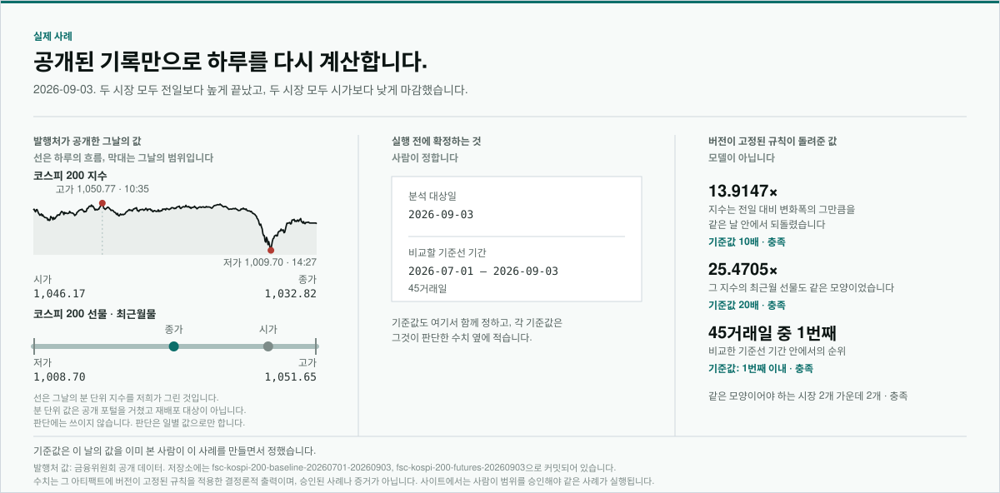
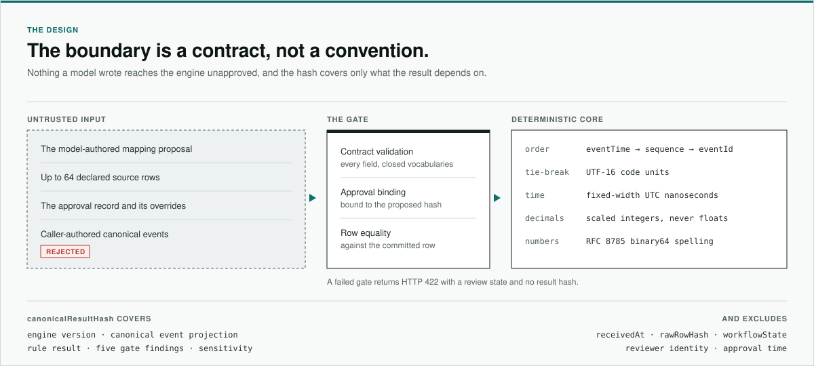

<!-- markdownlint-disable-file MD033 MD041 -->

  

<h1 align="center">WeaveTrail</h1>

  신호를 다시 확인할 수 있는 증거로.

  
  
  

  <a href="https://weave-trail-web-flax.vercel.app"><b>서비스 열기</b></a>
  &middot;
  <a href="README.md">English</a>

  <a href="#알림은-아직-증거가-아닙니다">문제</a> &middot;
  <a href="#실제-사례">실제 사례</a> &middot;
  <a href="#층위-분리">층위</a> &middot;
  <a href="#경계는-관행이-아니라-계약입니다">설계</a> &middot;
  <a href="#어떻게-만들었나">구성</a>

시장감시 시스템이 하루를, 계좌를, 가격 움직임을 지목합니다. 그다음은 사람의
일입니다. 그 지목이 성립하는지, 어떤 기록에서 그 숫자가 나왔는지, 그 기록을
누가 어떻게 읽었는지, 그 판단이 달라지면 결과가 어떻게 달라지는지를 보여야
합니다. 같은 기록에서 그 답을 두 번째로 내놓는 일은, 처음 지목하는 일보다
어렵습니다.

그 두 번째 답을 만드는 데 쓰는 도구입니다. 사례 하나를 근거가 된 기록에서부터
다시 계산하고, 먼저 확인한 사람을 믿지 않아도 두 번째 사람이 그대로 따라갈 수
있는 흔적을 남깁니다.

- **쓰이는 자리 ·** 알림이나 이첩이 나온 뒤, 조사가 끝나기 전. 스스로 찾아내지
  않습니다. 사례를 지목하는 것은 다른 시스템입니다.
- **쓰는 사람 ·** 거래소의 시장감시 담당자, 증권사·은행의 준법감시 검토자,
  감독기관 조사자, 내부감사.
- **돌려주는 것 ·** 고정된 코드가 계산한 답, 그 답에 이른 계산, 그리고 숫자마다
  그 값이 나온 원본 기록.
- **하지 않는 일 ·** 위법 여부 판단, 의도 추정, 투자 권유.

## 알림은 아직 증거가 아닙니다

알림을 넘겨받은 사람은 어떤 기록에서 그 숫자가 나왔는지, 그 기록을 어떻게
읽었는지, 어느 버전의 어떤 규칙으로 계산했는지를 말할 수 있어야 합니다. 모델이
끼어들기 전에, 자료 자체가 이미 그 일을 어렵게 만듭니다.

- **시스템마다 다르게 적습니다 ·** 같은 항목의 이름도, 시각을 적는 방식도, 같은
  수를 적는 방식도 서로 다릅니다.
- **무엇이 같은 기록인지는 주어지지 않습니다 ·** 중복, 재사용된 번호, 늦게
  도착한 기록은 무엇을 하나로 볼지 정하기 전까지 서로 구분되지 않습니다.
- **모델은 돕는 동시에 위험을 더합니다 ·** 낯선 파일을 빠르게 읽어 주지만,
  매끄러운 설명이 빈 곳을 덮을 수 있고 읽는 쪽에서는 그 둘이 구분되지 않습니다.

결과를 어디까지 읽을 수 있는지는 [한계](docs/LIMITATIONS.ko.md)에 있습니다.

## 실제 사례

2026년 9월 3일, 코스피 200은 전일보다 아주 조금 높게 끝났습니다. 그런데 같은 날
안에서는 고가에서 그 상승폭의 약 14배를 되돌렸고, 그 지수를 기초로 한 선물은 약
25배를 되돌렸습니다. 종가만 봐서는 알 수 없는 일입니다. 누군가 이 날짜를
건네면서 한 번 더 볼 만한지 묻는다고 해 봅시다.

공개된 기록은 발행된 그대로 읽습니다. 무엇을 볼지 — 분석할 날, 비교할 기간,
되돌림을 얼마나 크게 볼지 — 는 사람이 실행 전에 정합니다. 그다음 고정된 코드가
계산하고, 그날이 그 기간 안에서 어디쯤인지 알려 줍니다. 관측값은 그 값을 읽어 온
공개 원본 행까지 열어 볼 수 있습니다. 기준값은 사람이 정한 것이라고 밝히고,
순위는 승인된 기간 전체를 가로질러 계산합니다. 같은 입력으로 다시 실행하면 같은
결과가 나옵니다.

말하지 않는 것도 분명합니다. 누가 거래했는지, 왜 그랬는지, 잘못이 있었는지는
말하지 않습니다. 비교 기간과 기준값은 이 날의 값을 이미 본 사람이 정했고,
결과는 그 사실과 함께 읽어야 합니다.

[사례 따라가기](https://weave-trail-web-flax.vercel.app/case-2026-09-03)
&middot; [한계](docs/LIMITATIONS.ko.md)

## 층위 분리

**AI가 제안하고, 사람이 승인하고, 코드가 판정하고, 증거가 원본까지 이어집니다.**

모델을 망 밖에 두면 데이터는 지켜지지만 더 어려운 문제는 그대로 남습니다.
검증되지 않은 판단은 내부에서도 그대로 사건 기록에 들어갈 수 있습니다. 그래서
위치가 아니라 권한으로 나눕니다. 각 층에는 할 수 있는 일, 절대 할 수 없는 일,
그리고 남겨야 하는 기록이 정해져 있습니다.

먼저 답하는 질문은 일부러 좁게 잡았습니다.

> 짧은 구간의 가격 상승이 승인된 계좌 집단의 반복적이고 집중된 매수라는 선언된
> 패턴에 들어맞는가, 그리고 그 집단의 거래를 빼면 같은 숫자가 어떻게 되는가?

- **해석 · 모델 ·** 낯선 파일을 읽고 각 열이 무엇을 뜻하는지, 그렇게 본 근거와
  확신도를 함께 제안합니다. 행을 고치거나, 값을 계산하거나, 결론을 갖지
  않습니다.
- **승인 · 사람 ·** 그 제안을 그대로 승인합니다. 모델이 표시해 둔 항목은 사유를
  적어야 통과합니다. 승인은 무엇을 볼지 고정할 뿐, 나온 결과를 고치지 못합니다.
- **판정 · 고정된 코드 ·** 승인된 자료를 승인된 기준과 비교해 세 가지 답 중
  하나를 내놓습니다. 패턴이 성립한다, 성립하지 않는다, 판단할 만큼 증거가
  충분하지 않다. 세 번째도 결과이지 실패가 아닙니다.
- **증거 ·** 판단 항목을 열면 그 아래 원본 행을 그대로 읽을 수 있습니다. 출처를
  되짚을 수 없는 숫자는 보여 주지 않고 보류합니다.

이 분리를 떠받치는 규칙은 둘이고, 문서가 아니라 코드에 있습니다.

1. **한 층이 두 권한을 갖지 않습니다.** 제안하는 층은 승인하지 못하고, 승인하는
   층은 계산하지 못하며, 계산하는 층은 받은 범위를 넓히지 못합니다.
2. **결과는 조건과 함께 성립합니다.** 일반적으로 참인 것이 아니라, 이 버전의 이
   규칙으로, 승인된 이 범위에서, 옆에 함께 표시된 기준값에 대해 참입니다.

결과는 기술적 패턴에 관한 것이지 위법성이나 의도, 유죄에 관한 것이 아닙니다.
특정 집단의 거래를 빼고 다시 계산하는 것도 산술이며, 원인에 대한 진술이
아닙니다.

2026년 6월 22일 시행된
[금융분야 AI 가이드라인](https://www.fsc.go.kr/no010101/87142)은 최종 판단과 그
책임이 사람에게 남는다고 보고, 함께 나온 감독 리스크관리 체계는 출시 전 검증과
전 과정의 문서화를 요구합니다. 층위 분리는 그 요구를 조사 하나 안에서 지키는 한
가지 방법입니다. 설계상의 정합성일 뿐 인증이나 승인, 추천을 뜻하지 않습니다.

규칙과 판단 항목, 그리고 답하지 않는 경우는
[방법론](docs/METHODOLOGY.ko.md)에 있습니다.

## 경계는 관행이 아니라 계약입니다

같은 결과가 다시 나온다는 것은 약속이 아니라 강제되는 조건입니다. 시각을 어떻게
적는지, 순서가 같을 때 무엇으로 가리는지, 소수를 어떻게 비교하는지, 결과 해시가
무엇까지 포함하는지는 미리 정해 두고 시험합니다.

- **모델이 쓴 것은 승인 없이 넘어오지 않습니다 ·** 기록은 모델이 건넨 것이
  아니라 저장된 파일에서 승인된 해석을 거쳐 다시 만들어집니다.
- **중요한 곳에 부동소수점을 쓰지 않습니다 ·** 가격과 기준값은 반올림된 몫이
  아니라 정확한 값으로 비교합니다.
- **해시는 실행이 아니라 답에 대한 것입니다 ·** 같은 행의 순서를 섞어도 해시는
  그대로입니다. 조사 범위나 기준값을 바꾸면 답이 함께 바뀌고, 누가 언제 승인했는지
  바뀐 것은 승인 기록에 남아 그대로 확인할 수 있습니다.
- **거부는 분명히 드러납니다 ·** 충족할 수 없는 조건을 만나면 더 약한 답을
  내놓는 대신 거기서 멈추고 아무 답도 내놓지 않습니다.

해석 단계의 모델은 무엇을 건넬 수 있는지로 정의되어 있어서, 경계를 옮기지 않고
교체할 수 있습니다.

신뢰 경계는 [아키텍처](docs/ARCHITECTURE.ko.md)에, 각 선택의 이유는
[결정 기록](docs/adr)(영문)에 있습니다.

## 어떻게 만들었나

저장된 기록에서 증거까지 하나의 사슬로 이어지고, 구성요소 사이의 모든 인계는
관행이 아니라 계약입니다. 각 구성요소는 그 결과를 누가 만들었는지에 따라 —
모델인지, 사람인지, 고정된 코드인지 — 색이 다릅니다. "이건 누가 정했나"라는
질문에 그림 자체가 답합니다. 두 개는 명세만 있고 아직 만들지 않았으며, 그림에도
그렇게 적혀 있습니다.

신뢰 경계와 결과 해시가 포함하는 범위는 [아키텍처](docs/ARCHITECTURE.ko.md)에,
규칙과 판단 항목은 [방법론](docs/METHODOLOGY.ko.md)에, 각 선택의 이유는
[결정 기록](docs/adr)(영문)에 있습니다.

## 실제로 돌려 보기

[배포된 서비스](https://weave-trail-web-flax.vercel.app)는 `/replay`에서 사례
하나를 따라가는 화면으로 시작합니다. 배포된 판은 이 저장소의 현재 상태와 다를 수
있고, 여기 적힌 내용이 이 판이 배포되어 있다는 뜻은 아닙니다.

따라가기는 파일 하나를 사슬 전체에 통과시킵니다. 실제 행을 읽고, 각 열의 뜻으로
모델이 제안한 내용을 검토하고, 그 해석과 조사 범위를 직접 승인하고, 실행하고,
결과를 그 근거가 된 행까지 열어 봅니다. 두 번째 예시에는 모델이 해석하지 못한
열이 하나 있어서 사유를 적어야 승인할 수 있고, 그 승인으로 본 사례를 실행할 수는
없습니다. 승인한 같은 사례를 다시 실행하면 두 번째 해시가 나오고, 첫 번째와
비교할 수 있습니다.

승인과 결과는 열어 둔 화면 안에만 남아서, 새로 고치면 승인 전 상태로
돌아갑니다. 사례는 공개된 시장 기록을 빼면 모두 합성 데이터이고, 그 공개 기록은
재배포를 허용하는 라이선스 아래 출처와 취득 시점을 함께 기록해 커밋했습니다.
기본 설정에서는 해석 단계가 모델을 호출하지 않고 저장된 고정 응답을 쓰며, 배포
환경에는 모델 인증 정보가 없습니다. 로컬에서 실행하는 방법은
[Contributing](CONTRIBUTING.md)(영문)에 있습니다.

## 문서

- [아키텍처](docs/ARCHITECTURE.ko.md) — 구성요소와 신뢰 경계
- [방법론](docs/METHODOLOGY.ko.md) — 결과의 의미와 구현된 규칙
- [평가 프로토콜](docs/EVALUATION.ko.md) — 공개하는 모든 측정값의 정의와 재현
  방법
- [한계](docs/LIMITATIONS.ko.md) — 하지 않는 일과 해석의 경계
- [일별 시세 정규화](docs/DAILY_QUOTES.ko.md) — 공개 시장 자료의 출처, 이용
  허락 범위, 재현 절차
- [시나리오별 예상 결과](https://weave-trail-web-flax.vercel.app/expectations)
  — 커밋된 각 사례가 무엇을 돌려주는지, 엔진 출력 그대로
- [배포](docs/DEPLOYMENT.md)(영문) — 공개 주소, 설정, 점검, 되돌리기
- [결정 기록](docs/adr)(영문) — 각 설계 선택의 이유
- [Contributing](CONTRIBUTING.md)(영문) — 작업 절차와 검증 기준

한국어 문서는 영문 문서의 번역본이고, 기준이 되는 판은 영문입니다. 두 판이
어긋나면 영문을 따릅니다.

## 라이선스

이 저장소가 직접 작성한 소스 코드와 문서는
[Apache License 2.0](LICENSE)(영문)이 적용됩니다. 서드파티 패키지는 각자의
라이선스를 유지합니다. [라이선스와 배포](docs/LICENSING.md)(영문)와
[서드파티 고지](THIRD_PARTY_NOTICES.md)(영문)를 참고하세요.
