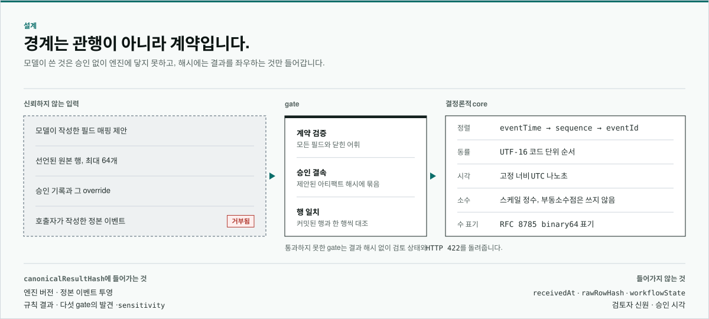

<!-- markdownlint-disable-file MD033 MD041 -->

  

<h1 align="center">WeaveTrail</h1>

  결정론적 사례 재생, 그리고 어떤 모델에 데이터 항목 연결 제안을 맡길지 측정으로
  고르는 계획.

  
  
  

  <a href="https://weave-trail-web-flax.vercel.app"><b>서비스 열기</b></a>
  &middot;
  <a href="README.md">English</a>

  영문 문서가 기준입니다.

  <a href="#어떤-모델에-어디까지-맡기나">문제</a> &middot;
  <a href="#합성-사례">합성 사례</a> &middot;
  <a href="#층위-분리">층위</a> &middot;
  <a href="#경계는-관행이-아니라-계약입니다">설계</a> &middot;
  <a href="#어떻게-맞물리나">계획</a>

처음 보는 거래 파일에서 무엇이든 계산하려면 먼저 누군가 그 파일을 읽어야 합니다.
어느 열이 사건 시각이고, 어느 열이 가격이고, 어느 열이 계좌인지. 언어 모델은 열 이름과
표본 몇 행만으로 그 읽기를 제안할 수 있지만, 자신 있게 틀릴 수도 있습니다.

WeaveTrail은 한 가지 질문에 숫자와 코드로 답하도록 개발 중입니다. **그 읽기를 어떤
모델에 왜 맡겼고, 어디까지 믿으며, 틀리거나 모호한 답이 나오면 시스템이 그것을 어떻게
통제하는가.** 아래의 결정론적 재생 엔진은 이미 모든 결과를 냅니다. 지금 하는 일은 그
입력을 제안하는 모델을 측정하고, 고르고, 제한하는 것입니다.

**현재 상태:** 결정론적 재생 엔진과 증거 해시, 합성 사례 따라가기, 데이터 항목 연결과
조사 범위의 계약, 봉인된 합성 스키마 방언 평가 집합, 매핑 실행 기록 계약, 적대 탐침을
갖춘 공통 매핑 검증기, [AI 실패 기록](docs/AI_FAILURE_LOG.ko.md)은 구현되어 있습니다.
모델 실행과 채점, 비모델 기준선, 모델 선택, 라우팅, 조사 범위 제안은 계획 상태입니다.
보관 평가 집합에서 돌린 모델은 아직 없으므로, 이 저장소는 모델의 정확도·비교·선택을
공개하지 않습니다.

- **읽는 자료 ·** 열 이름이 낯선 합성 체결·시세 파일. 파일마다 출처 기록을 옆에
  둡니다. 실제 시세 자료와 그 위의 화면은 철회되었습니다.
- **모델이 할 수 있는 일 ·** 데이터 항목 연결 제안, 그리고 계획대로라면 코드가 먼저
  계산한 값 안에서 고르는 조사 범위 제안. 그 밖에는 없습니다.
- **제공할 예정인 것 ·** 봉인된 보관 평가 집합에서 비모델 기준선과 나란히 놓은 모델
  비교, 그 실행 전에 고정한 규칙에 따른 선택, 그리고 한 번만 상위 모델로 올리고 그
  밖에는 검토에서 멈추는 제안 경로.
- **하지 않는 일 ·** 모델에게 계산·승인·결과 판정을 맡기는 일, 원인·의도·위법 판단,
  계좌 지목, 가격 전망, 투자 권유.

## 어떤 모델에 어디까지 맡기나

데이터 항목 연결은 범위가 좁고 확인할 수 있어서 측정할 가치가 있고, 잘못된 연결은
만들기는 쉽고 놓치면 비쌉니다.

- **틀린 연결이 맞아 보일 수 있습니다 ·** 가격과 수량처럼 모양이 같은 두 열을
  바꿔 놓으면 형식 검사를 모두 통과합니다. 검증기는 이를 잡지 못하고 검토만 잡을 수
  있으며, 평가는 이를 남는 위험으로 밝힙니다.
- **모델 하나를 호출하는 것은 선택이 아닙니다 ·** 보관 평가 집합, 비모델 기준선,
  실행 전에 고정한 규칙이 없으면 "이 모델을 골랐다"는 나중에 쓴 설명일 뿐입니다.
- **모호함도 맞는 답입니다 ·** `amt`는 수량일 수도, 거래 금액일 수도 있습니다.
  추측하는 모델은 `REVIEW_REQUIRED`를 내는 모델보다 못하고, 늘 판단을 미루는 모델은
  아무에게도 도움이 되지 않으므로 둘 다 셉니다.

결과를 어디까지 읽을 수 있는지는 [한계](docs/LIMITATIONS.ko.md)에 있습니다.

## 합성 사례

현재 사례 따라가기는 공개 FIX 4.4 필드 이름을 쓰는 합성 체결 자료입니다.
항목 연결과 조사 범위를 승인하고 규칙을 실행하면 각 발견을 원본 행과 해시까지
확인할 수 있습니다. 같은 입력으로 다시 실행해 결과 해시를 비교합니다.
실제 시세 자료와 이를 사용한 화면은 철회되었습니다.

[사례 따라가기](https://weave-trail-web-flax.vercel.app/replay)
&middot; [철회 결정](docs/adr/0056-withdraw-the-committed-real-data-tier.md)(영문)

## 층위 분리

**AI가 제안하고, 사람이 승인하고, 코드가 검증하며, 증거는 원천으로 이어집니다.**

모델의 답은 매끄러우면서도 틀릴 수 있고, 매끄러움이 빈 곳을 덮을 수 있습니다. 그래서 일을
권한으로 나눕니다. 각 층에는 할 수 있는 일, 절대 할 수 없는 일, 남겨야 하는 기록이
정해져 있습니다.

- **제안 · 모델 ·** 열 이름과 최대 여덟 개의 표본 행을 읽고, 열마다 정본 필드와
  허용된 변환을 이유와 함께 제안하거나 `REVIEW_REQUIRED`를 냅니다. 계획대로라면
  데이터셋 프로파일 안에서 조사 범위도 고릅니다. 값을 계산하거나, 없는 열을
  만들거나, 무엇을 승인하지 않습니다.
- **승인 · 사람 ·** 실행 전에, 정확히 그 제안의 해시에 묶인 데이터 항목 연결과 조사
  범위를 승인합니다. 승인은 나온 결과를 고치지 못합니다.
- **검증 · 고정된 코드 ·** 모든 모델 출력을 닫힌 계약으로 검증하고, 표본 행에 각
  변환을 시험 적용하고, 저장된 원본 행에서 이벤트를 다시 만들고, 버전이 고정된
  규칙을 평가합니다. 거절되거나 모호한 제안은 `REVIEW_REQUIRED`로 닫힙니다.
- **증거 ·** 모든 판단 근거는 정본 `eventId`와 `rawRowHash`까지 열립니다. 계획된
  모델 실행을 위한 실행 기록 계약이 있습니다. 모델, 프롬프트 버전, 검증 결과, 지연,
  토큰을 남깁니다.

모델이 맡는 역할은 둘이고, 둘뿐입니다.

| 역할                  | 모델이 제안하는 것                                                  | 코드가 먼저 정하는 것                                                                          | 모델이 할 수 없는 일                                                  | 상태                                                                                      |
| --------------------- | ------------------------------------------------------------------- | ---------------------------------------------------------------------------------------------- | --------------------------------------------------------------------- | ----------------------------------------------------------------------------------------- |
| 데이터 항목 연결      | 열마다 정본 필드와 허용된 변환, 그리고 이유. 또는 `REVIEW_REQUIRED` | 열 목록, 대상·변환 목록, 계약, 시험 적용                                                       | 없는 열 만들기, 목록 밖 변환, 원본 값 바꾸기, 승인                    | 고정 응답과 설정형 어댑터 하나가 있음. 평가(`v0.2.0`)·라우팅(`v0.3.0`)은 계획             |
| 제한된 조사 범위 제안 | 프로파일 안에서 고른 종목, 행위자 그룹, 시간 구간, 규칙 버전        | `DatasetProfile`: 종목, 행위자, 가장 이른·늦은 사건 시각. 사건 수, 후보 구간, 규칙 버전은 계획 | 없는 행위자 만들기, 시간 범위 넓히기, 결과 미리 말하기, 기준값 정하기 | 프로파일과 그 종목·행위자·시간 검사가 있음. 규칙 버전·기준값 제한과 제안(`v0.4.0`)은 계획 |

> 코드가 가능한 공간을 정하고, AI는 그 안에서 제안하며, 사람이 결정합니다.

두 역할 모두 결과를 판정하지 않고, 상위 모델로 올라가도 마찬가지입니다.
`SUPPORTED`, `NOT_SUPPORTED`, `INCONCLUSIVE`는 승인된 데이터 항목 연결과 조사 범위
위에서 결정론적 엔진만 냅니다.

이 분리를 떠받치는 규칙은 둘이고, 문서가 아니라 코드에 있습니다.

1. **한 층이 두 권한을 갖지 않습니다.** 제안하는 층은 승인하지 못하고, 승인하는
   층은 계산하지 못하며, 계산하는 층은 받은 범위를 넓히지 못합니다.
2. **결과는 조건과 함께 성립합니다.** 일반적으로 참인 것이 아니라, 이 버전의 이
   규칙으로, 이 승인된 입력에서, 옆에 함께 표시된 기준값에 대해 참입니다.

결과는 데이터가 버전이 정해진 패턴 가설을 뒷받침하는지를 말할 뿐, 왜 그런 일이
일어났는지, 누가 잘못했는지, 가격이 어디로 갈지는 말하지 않습니다.

2026년 6월 22일 시행된
과거 정책 참고: [금융분야 AI 가이드라인](https://www.fsc.go.kr/no010101/87142)은 최종 판단과 그
책임이 사람에게 남는다고 보고, 함께 나온 감독 리스크관리 체계는 출시 전 검증과 전
과정의 문서화를 요구합니다. 층위 분리는 그 요구를 지키는 한 가지 방법입니다.
설계상의 정합성일 뿐 인증이나 승인, 추천을 뜻하지 않습니다.

규칙과 판단 항목, 그리고 답하지 않는 경우는
[방법론](docs/METHODOLOGY.ko.md)에 있습니다.

## 경계는 관행이 아니라 계약입니다

같은 결과가 다시 나온다는 것은 약속이 아니라 강제되는 조건입니다. 시각을 어떻게
적는지, 순서가 같을 때 무엇으로 가리는지, 소수를 어떻게 비교하는지, 결과 해시가
무엇까지 포함하는지는 미리 정해 두고 시험합니다.

- **모델이 쓴 것은 승인 없이 넘어오지 않습니다 ·** 계약을 통과하지 못한 출력은
  데이터 항목 연결로 검토에 오르지 않고, 이벤트는 모델이 건넨 것이 아니라 저장된
  원본 행에서 다시 만들어집니다.
- **중요한 곳에 부동소수점을 쓰지 않습니다 ·** 가격과 기준값은 반올림된 몫이
  아니라 정확한 값으로 비교합니다.
- **모델 실행은 재현이 아니라 기록입니다 ·** 실행 기록 계약은 파싱된 출력, 검증
  결과, 지연, 토큰을 남기고 제공자의 원시 응답 봉투는 남기지 않습니다. 계획된 채점기는
  커밋된 기록을 다시 채점하면 같은 요약을 내야 하며, 모델을 다시 돌리면 새 기록이 됩니다.
- **해시는 실행이 아니라 답에 대한 것입니다 ·** 같은 행의 순서를 섞어도 해시는
  그대로입니다. 누가 언제 승인했는지는 승인 기록에 남아 그대로 확인할 수 있습니다.
- **거부는 분명히 드러납니다 ·** 충족할 수 없는 조건을 만나면 더 약한 답을
  내놓는 대신 거기서 멈추고 아무 답도 내놓지 않습니다.

모델은 무엇을 건넬 수 있는지로 정의되어 있어서, 경계를 옮기지 않고 교체할 수
있습니다.

신뢰 경계는 [아키텍처](docs/ARCHITECTURE.ko.md)에, 각 선택의 이유는
[결정 기록](docs/adr)(영문)에 있습니다.

## 어떻게 맞물리나

계획은 버전마다 측정된 단계를 하나씩, 위의 경계 위에 더합니다. 이미 있는 것은
`develop`에 있고, 나머지는 모두 계획이며
[마일스톤](https://github.com/WeaveTrail/WeaveTrail/milestones)에서 추적합니다. 평가가
공개되기 전까지는 어떤 결과도 내놓지 않습니다.

- **`v0.2.0` · 평가 하네스 ·** 있는 것: 봉인된 합성 DEV·HELD_OUT 스키마 방언 집합,
  실행 기록 계약, 적대 탐침을 갖춘 공통 검증기, 프롬프트 버전 목록을 담은 AI 실패
  기록, 설정으로 바꾸는 Chat Completions 어댑터와 정제된 실행 기록을 남기는
  명시적 로컬 확인 명령. 계획: 비모델 어휘 기준선과 나란히 정확도·없는 필드 연결·판단 유보·검증기 거절·지연·비용 채점,
  보관 평가 집합 실행 전에 고정하는 선택 규칙, 평가 화면과 홈 화면의 모델 비교.
- **`v0.3.0` · 측정 기반 라우팅 ·** 계획. 기본 모델이 제안하고 검증기가 확인합니다.
  유효하고 명확한 제안은 검토로 가고, 모호하거나 거절된 제안은 기본 모델의 출력을
  보지 않는 상위 모델에 한 번 가서 같은 검증기를 거쳐 검토로 가거나
  `REVIEW_REQUIRED`에서 멈춥니다. 호출은 최대 두 번이고, 두 모델의 필드를 섞지 않으며,
  어떤 경로도 승인을 만들지 않습니다. 이 정책을 보관 평가 집합에서 단일 모델
  기준선과 비교합니다.
- **`v0.4.0` · 제한된 조사 범위 제안 ·** 계획. 모델은 데이터셋 프로파일의 값으로만
  조사 범위를 제안하고, 프로파일 밖 값과 주입 탐침으로 검증기를 시험하며, 사람은
  승인 전에 프로파일 옆에서 그 범위를 검토합니다.

사례 재생은 같은 분리를 깊이 들여다보는 전문가 화면입니다. 모델이 낯선 파일의
각 열이 무엇을 뜻하는지 제안하고, 사람이 그 해석과 조사 범위를 승인하고, 버전이
고정된 코드가 사례를 다시 계산하고, 모든 판단 근거를 원본 행까지 열어 봅니다.

신뢰 경계와 결과 해시가 포함하는 범위는 [아키텍처](docs/ARCHITECTURE.ko.md)에,
모든 측정의 정의와 재현 방법은 [평가 프로토콜](docs/EVALUATION.ko.md)에, 각 선택의
이유는 [결정 기록](docs/adr)(영문)에 있습니다.

## 실제로 돌려 보기

[배포된 서비스](https://weave-trail-web-flax.vercel.app)는 `main` 브랜치를 따르며
이 저장소의 현재 상태와 다를 수 있습니다. 현재 체크아웃은 `/replay`의 합성 사례
따라가기를 제공하고, 평가 하네스는
[v0.2.0 마일스톤](https://github.com/WeaveTrail/WeaveTrail/milestone/2)에서
추적합니다.

사례 재생은 파일 하나를 사슬 전체에 통과시킵니다. 실제 행을 읽고, 각 열의 뜻으로
모델이 제안한 내용을 검토하고, 그 해석과 조사 범위를 승인하고, 실행하고, 결과를 그
근거가 된 행까지 열어 봅니다. 승인과 결과는 열어 둔 화면 안에만 남아서, 새로 고치면
승인 전 상태로 돌아갑니다. 현재 사례는 모두 합성 데이터이며 출처 기록을 옆에 둡니다. 기본 설정에서는 해석 단계가 모델을 호출하지 않고 저장된 고정 응답을
쓰며, 배포 환경에는 모델 인증 정보가 없습니다. 로컬에서 실행하는 방법은
[Contributing](CONTRIBUTING.md)(영문)에 있습니다.

## 문서

- [아키텍처](docs/ARCHITECTURE.ko.md) — 구성요소와 신뢰 경계
- [방법론](docs/METHODOLOGY.ko.md) — 결과의 의미와 구현된 규칙
- [평가 프로토콜](docs/EVALUATION.ko.md) — 공개하는 모든 측정값의 정의와 재현
  방법
- [AI 실패 기록](docs/AI_FAILURE_LOG.ko.md) — 관찰된 모델·검증기 실패와 수정,
  회귀 테스트, 모든 프롬프트 버전
- [한계](docs/LIMITATIONS.ko.md) — 하지 않는 일과 해석의 경계
- [데이터 처리](docs/DATA_HANDLING.ko.md) — 확인 요청이 보내고 남기고 기록하는
  내용과 이를 강제하는 테스트
- [종목과 지수 연결](docs/INSTRUMENT_RESOLUTION.ko.md) — 날짜별 이름·코드 매칭, 모호한 후보, 시세 연결과 스냅숏 참조
- [일별 시세 계약](docs/DAILY_QUOTES.ko.md) — 유지된 버전, 합성 검사와 철회된 자료 경계
- [시나리오별 예상 결과](https://weave-trail-web-flax.vercel.app/expectations)
  — 커밋된 각 사례가 무엇을 돌려주는지, 엔진 출력 그대로
- [배포](docs/DEPLOYMENT.md)(영문) — 공개 주소, 설정, 점검, 되돌리기
- [결정 기록](docs/adr)(영문) — 각 설계 선택의 이유
- [Contributing](CONTRIBUTING.md)(영문) — 작업 절차와 검증 기준

한국어 문서는 영문 문서의 번역본입니다. 두 판이 어긋나면 영문을 따릅니다.

## 라이선스

이 저장소가 직접 작성한 소스 코드와 문서는
[Apache License 2.0](LICENSE)(영문)이 적용됩니다. 서드파티 패키지는 각자의
라이선스를 유지합니다. [라이선스와 배포](docs/LICENSING.md)(영문)와
[서드파티 고지](THIRD_PARTY_NOTICES.md)(영문)를 참고하세요.
