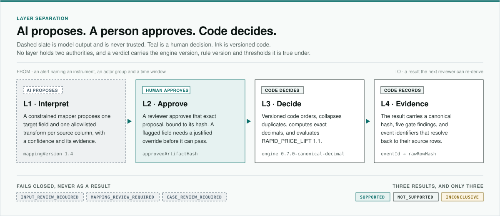

<!-- markdownlint-disable-file MD033 MD041 -->

<p align="center">
  
</p>

<h1 align="center">WeaveTrail</h1>

<p align="center">
  Weave signals into replayable evidence.
</p>

<p align="center">
  <a href="https://github.com/WeaveTrail/WeaveTrail/actions/workflows/ci.yml?query=branch%3Amain"></a>
  
  
</p>

<p align="center">
  <a href="#an-anomaly-alert-is-not-yet-evidence">Problem</a> &middot;
  <a href="#ai-proposes-a-person-approves-code-decides">Approach</a> &middot;
  <a href="#the-boundary-is-a-contract-not-a-convention">Design</a> &middot;
  <a href="#run-it">Run it</a>
</p>

WeaveTrail is an investigation workbench for the step after a market-surveillance
alert. Surveillance and AI-assisted analysis narrow the field to a suspect
instrument, an actor group and a time window; turning one of those candidates
into a result a second investigator can re-derive is a different problem.
WeaveTrail is where that handoff happens. A constrained model proposes how each
source column maps to a versioned contract, a person approves that exact
proposal, and versioned code replays it so every finding points back at the
execution it came from.

## An anomaly alert is not yet evidence

An alert names a candidate. Whoever picks it up has to say which orders and
executions produced the number, under which mapping, and under which rule
version — and the source systems make that hard before a model is anywhere near
it. One feed is CSV with a `+09:00` offset and a `side_code` column; the next is
JSON Lines with a `Z` timestamp and a `direction` column. Nothing inside either
file says they describe the same executions, and nothing says which one wins
when they disagree.


- **Trading feeds disagree by construction ·** field names, time precision,
  decimal spelling and what a resend means all differ between an exchange and a
  broker, and each difference is a place where a reconciliation can be wrong
  without being visibly wrong.
- **Identity is not given ·** an exact duplicate, a reused order reference with
  new content and a late arrival look alike until something decides what "the
  same execution" means.
- **A model adds a second boundary ·** a mapper narrows the ambiguity, but its
  output is a proposal. A column with no defensible target field stops for
  review rather than being guessed at, because a plausible summary can hide a
  gap that the next reviewer will find.

See [Limitations](docs/LIMITATIONS.md) for what a result is allowed to mean.

## AI proposes. A person approves. Code decides.

The first case is bounded on purpose:

> Does the observed short-window price lift support a versioned pattern of
> repeated, concentrated aggressive buying by the approved actor group — and how
> do the same metrics move when that group's executions are mechanically
> removed?

The model's job ends at a structured proposal. Approval is a separate,
human-owned act bound to the hash of the exact artifact that was proposed, and
the engine will not run without it.



- **Propose ·** the mapper returns one target field and one allowlisted
  transform per source column, each with a confidence and its evidence. An
  unknown column, a low confidence or an unsupported transform is
  `REVIEW_REQUIRED`, not a guess.
- **Approve ·** the approval record binds to the proposed artifact hash, and a
  flagged field needs a justified override before it clears.
- **Replay ·** `RAPID_PRICE_LIFT` version `1.1` reports `SUPPORTED`,
  `NOT_SUPPORTED` or `INCONCLUSIVE` across five gates. Abstention is a
  first-class outcome, not an error to hide.
- **Trace ·** the result carries the canonical hash, the five gate findings, the
  actor-removal comparison and event identifiers that resolve to `rawRowHash` on
  the source row.

Determinism here is pinned rather than asserted. Every permutation of a source
event set resolves to one canonical hash. Equivalent CSV and JSON Lines
dialects converge to a single canonical dataset while keeping their own
artifact and row hashes. Each of the three results is anchored to a reference
scenario by a literal golden hash.

The output boundary is part of the design. WeaveTrail reports pattern support,
the arithmetic behind it and the executions it rests on. It does not rule on
legality, intent or guilt, the actor-removal comparison is mechanical rather
than causal, and nothing it returns is investment advice.

See [Methodology](docs/METHODOLOGY.md) for the rule, the gates and the
abstention boundary.

## The boundary is a contract, not a convention

Determinism is not a property the engine tries to have. It is a set of choices
made once, written down as ADRs, and pinned by tests: how time is represented,
how ties break, how decimals are stored and compared, and what the result hash
is allowed to depend on.


- **Nothing model-authored crosses unapproved ·** the replay route rejects
  caller-authored canonical events outright and re-derives them from the stored
  rows through the approved mapping.
- **No floating point anywhere it matters ·** prices, quantities and thresholds
  stay decimal strings and compare as exact scaled-integer cross-products.
- **The hash covers the result, not the run ·** engine version, canonical
  events and rule outcome are inside it; `receivedAt`, `rawRowHash`,
  `workflowState`, reviewer identity and approval time are outside it.
- **Failure is a state, not an exception ·** a gate that cannot be satisfied
  returns HTTP `422` with a review state and no result hash.

The mapper is defined by its contract rather than by its provider, so the model
behind it stays an implementation detail that can be swapped without moving the
boundary.

See [Architecture](docs/ARCHITECTURE.md) for the trust boundaries and the
package split, and the [ADRs](docs/adr) for why each choice was made.

## Run it

Node.js 22+ and pnpm 10.33.2.

```bash
cp .env.example apps/web/.env.local
pnpm install
pnpm dev
```

Open <http://localhost:3000/lab> and walk the whole path: a proposal, a review
with a justified override, an approval, and the replay it authorises. The
deployed workbench at
[weave-trail-web-flax.vercel.app](https://weave-trail-web-flax.vercel.app)
runs the same engine over the same reference scenarios.

```bash
pnpm test
pnpm typecheck
pnpm build
```

See [Deployment](docs/DEPLOYMENT.md) for the recorded Vercel settings, the
environment boundary and the rollback procedure.

## Documentation

- [Architecture](docs/ARCHITECTURE.md) — components and trust boundaries
- [Methodology](docs/METHODOLOGY.md) — result semantics and the implemented rule
- [Evaluation](docs/EVALUATION.md) — how every published measurement is defined
  and reproduced
- [Limitations](docs/LIMITATIONS.md) — non-goals and interpretation boundaries
- [Deployment](docs/DEPLOYMENT.md) — public URL, settings, checks and rollback
- [Contributing](CONTRIBUTING.md) — workflow and validation expectations

## License

Original source code and documentation are licensed under the
[Apache License 2.0](LICENSE). Third-party packages keep their own licences;
see [Licensing and distribution](docs/LICENSING.md) and
[Third-party notices](THIRD_PARTY_NOTICES.md).
