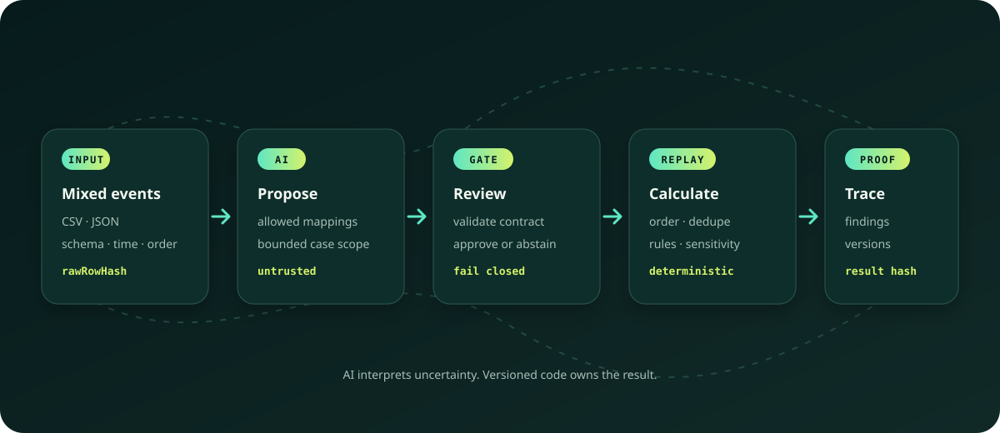

# WeaveTrail

**Weave signals into replayable evidence.**

WeaveTrail is an AI-assisted deterministic verification harness for
heterogeneous event data. It constrains AI to schema interpretation and case
proposal, then uses versioned code to replay the approved hypothesis and trace
every result back to source events.

> **Repository status — foundation scaffold.** The committed implementation
> currently covers runtime contracts, deterministic ordering and deduplication,
> canonical hashing, synthetic fixtures, and a guided local lab. AI-backed
> mapping, the financial rule engine, counterfactual analysis, and measured
> evaluation results remain planned.

## Why it exists

An anomaly alert is not yet evidence. Source systems disagree on field names,
time formats, identifiers, and event ordering; model output adds another
uncertain boundary. WeaveTrail makes those boundaries reviewable and keeps the
final computation deterministic.



## System at a glance

1. **Interpret:** a constrained mapper proposes how source fields map to a
   versioned event contract.
2. **Approve:** ambiguous mappings and case scope stop for human review.
3. **Replay:** versioned code orders, deduplicates, calculates, and evaluates
   the approved manifest.
4. **Trace:** the evidence bundle records hashes, rule versions, findings, and
   source-event references.

AI proposes; deterministic code decides. See [Architecture](docs/ARCHITECTURE.md)
for the trust boundaries and component design.

## First application

The initial reference case asks one bounded question:

> Does the observed short-window price lift satisfy a versioned pattern of
> repeated aggressive buying by a concentrated actor group?

The planned `RAPID_PRICE_LIFT` rule reports only `SUPPORTED`,
`NOT_SUPPORTED`, or `INCONCLUSIVE`. It does not determine legal liability,
infer guilt, provide investment advice, or execute trades. See
[Methodology](docs/METHODOLOGY.md) and [Limitations](docs/LIMITATIONS.md).

## Run locally

Prerequisites: Node.js 22+ and pnpm 10.33.2.

```bash
cp .env.example apps/web/.env.local
pnpm install
pnpm dev
```

Open <http://localhost:3000/lab>. Fixture mode requires no API key.

## Verify the foundation

```bash
pnpm test
pnpm typecheck
pnpm build
```

The current golden tests verify stable ordering, duplicate tolerance, and an
identical canonical hash after input shuffling. No performance or detection
accuracy claim is made yet. The versioned measurement plan lives in
[Evaluation](docs/EVALUATION.md).

## Documentation

- [Architecture](docs/ARCHITECTURE.md) — component and trust boundaries
- [Methodology](docs/METHODOLOGY.md) — result semantics and planned rule
- [Evaluation](docs/EVALUATION.md) — reproducible metrics protocol, without
  unmeasured targets presented as results
- [Limitations](docs/LIMITATIONS.md) — non-goals and interpretation boundaries
- [Contributing](CONTRIBUTING.md) — workflow and validation expectations
