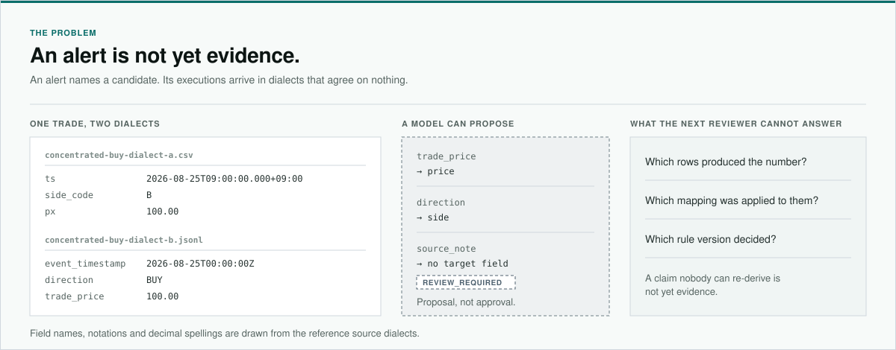

<!-- markdownlint-disable-file MD033 MD041 -->

  

<h1 align="center">WeaveTrail</h1>

  Weave signals into replayable evidence.

  
  
  

  <a href="#an-alert-is-not-yet-evidence">Problem</a> &middot;
  <a href="#layer-separation">Layers</a> &middot;
  <a href="#the-boundary-is-a-contract-not-a-convention">Design</a> &middot;
  <a href="#how-it-is-built">How it is built</a>

WeaveTrail is an investigation workbench for the step after a market-surveillance
alert. As surveillance turns AI-assisted, candidates arrive faster than anyone
can check them — and a candidate is not a finding until a second person can
re-derive it from the same executions.

- **Where it sits ·** after an alert or a referral, before an investigation
  concludes.
- **Who it is for ·** surveillance teams at a trading venue, compliance reviewers
  at a broker or bank, supervisory investigators, internal audit.
- **What it returns ·** a versioned pattern verdict, the arithmetic behind it,
  and every execution it rests on.
- **How it is built ·** [one chain with a contract at every handover](#how-it-is-built)
  — the components, the four trust boundaries, and what the canonical hash covers.

## An alert is not yet evidence

Whoever picks the alert up has to say which executions produced the number,
under which mapping, under which rule version. The feeds make that hard before
a model is anywhere near it.

- **Venues disagree by construction ·** field names, time precision, decimal
  spelling and resend semantics differ between any two systems.
- **Identity is not given ·** a duplicate, a reused order reference and a late
  arrival look alike until something defines "the same execution".
- **A model adds a second boundary ·** it narrows the ambiguity, but its output
  is a proposal, and a plausible summary can hide a gap.

See [Limitations](docs/LIMITATIONS.md) for what a result is allowed to mean.

## Layer separation

**AI proposes. A person approves. Code decides. Evidence carries it back.**

Keeping a model off the network protects the data and leaves the second boundary
open: an unverified judgement can still walk into a case file from inside the
perimeter. So the work is separated by authority rather than by location. Each
layer holds what it may do, what it may never do, and the record it leaves
behind.

The first case is bounded on purpose:

> Does a short-window price lift support a versioned pattern of repeated,
> concentrated aggressive buying by the approved actor group — and how do the
> metrics move when that group's executions are removed?

- **L1 Interpret · a model ·** proposes one target field and one allowlisted
  transform per source column, each with a confidence and its evidence. It
  never edits a row, computes a metric, or owns a result.
- **L2 Approve · a person ·** approves that exact proposal, bound to its
  artifact hash, and a flagged field needs a justified override to clear.
  Approval fixes the scope; it never edits a computed result.
- **L3 Decide · versioned code ·** `RAPID_PRICE_LIFT` reports `SUPPORTED`,
  `NOT_SUPPORTED` or `INCONCLUSIVE` across five gates, and reads nothing
  outside the approved scope. Abstention is a first-class outcome.
- **L4 Evidence ·** open any evaluated gate to inspect its canonical events,
  raw-row hashes, artifact coordinates, and unchanged source values. A finding
  whose lineage cannot be resolved is refused rather than displayed, and
  `INCONCLUSIVE` displays no finding evidence.

Two invariants hold the separation up, and both live in contracts rather than in
guidance:

1. **No layer holds two authorities.** The proposing layer cannot approve, the
   approving layer cannot compute, and the deciding layer cannot widen its own
   scope.
2. **A verdict carries the conditions it is true under.** Not true in general,
   but true for one engine version, one rule version and one approved scope —
   and the result travels with those versions and with the threshold each gate
   compared against.

The verdict is about a technical pattern, not legality, intent or guilt, and the
actor-removal comparison is mechanical rather than causal.

Korea's [financial AI guideline](https://www.fsc.go.kr/no010101/87142), in force
since 22 June 2026, holds that the final decision and the responsibility for it
stay with a person, and the supervisory AI risk-management framework issued
alongside it asks for verification before release and documentation across the
process. Layer separation is one way to carry that out inside a single
investigation. It is a design alignment, not a certification, an approval, or an
endorsement.

See [Methodology](docs/METHODOLOGY.md) for the rule, the gates and the
abstention boundary.

## The boundary is a contract, not a convention

Determinism is pinned rather than asserted: how time is represented, how ties
break, how decimals compare, and what the result hash may depend on are fixed
choices, written down and tested.

- **Nothing model-authored crosses unapproved ·** canonical events are
  re-derived from stored rows through the approved mapping.
- **No floating point where it matters ·** prices and thresholds stay decimal
  strings and compare as exact scaled integers.
- **The hash covers the result, not the run ·** every permutation of a source
  set resolves to one canonical hash.
- **Failure is a state ·** a gate that cannot be satisfied returns a review
  state and no result hash.

The mapper is defined by its contract rather than its provider, so the model
behind it can be swapped without moving the boundary.

See [Architecture](docs/ARCHITECTURE.md) for the trust boundaries, and the
[ADRs](docs/adr) for why each choice was made.

## How it is built

One chain runs from committed source rows to evidence, and every handover
between components is a contract rather than a convention. A component is
coloured by who authors it — a model, a person, or versioned code — so the
question "who decided this?" is answered by the diagram itself. Two components
are specified and not yet built, and they say so.

![Ten components in two rows: committed source rows are untrusted input; a constrained schema mapper proposes a field mapping; a reviewer approves that proposal bound to its artifact hash; versioned code re-derives the canonical event set and computes a deterministic dataset profile; a planned bounded case proposer would select an actor group and interval from profile facts alone; a reviewer approves the case scope; the deterministic replay engine evaluates the rule; the source trace resolves every finding back to its committed rows; Evidence Bundle assembly remains planned. Any gate can refuse, and a refused request carries no result hash](docs/assets/component-chain.svg)

[Architecture](docs/ARCHITECTURE.md) carries the trust boundaries and what the
canonical hash covers, [Methodology](docs/METHODOLOGY.md) the rule and its
gates, and the [ADRs](docs/adr) the reason behind each choice.

## Documentation

- [Architecture](docs/ARCHITECTURE.md) — components and trust boundaries
- [Methodology](docs/METHODOLOGY.md) — result semantics and the implemented rule
- [Evaluation](docs/EVALUATION.md) — how every published measurement is defined
  and reproduced
- [Limitations](docs/LIMITATIONS.md) — non-goals and interpretation boundaries
- [Deployment](docs/DEPLOYMENT.md) — public URL, settings, checks and rollback
- [Contributing](CONTRIBUTING.md) — workflow and validation expectations

## License

Original source code and documentation are licensed under the
[Apache License 2.0](LICENSE). Third-party packages keep their own licences;
see [Licensing and distribution](docs/LICENSING.md) and
[Third-party notices](THIRD_PARTY_NOTICES.md).
