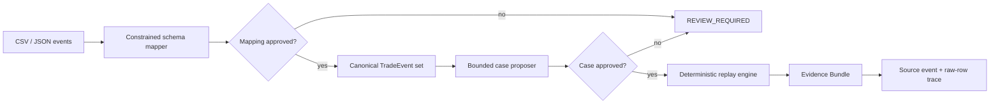

# WeaveTrail Architecture

WeaveTrail separates probabilistic interpretation from authoritative
calculation. A model can narrow ambiguity, but only validated inputs and
versioned code can produce a replay result.

## Component chain



## Trust boundaries

### Interpretation boundary

Provider output is untrusted data. The mapper may select only source columns
that exist and transforms from a fixed allowlist. Invalid shape, low confidence,
unknown columns, or unsupported transforms return `REVIEW_REQUIRED`.

### Approval boundary

The state machine prevents unapproved output from reaching replay:

```text
UPLOADED -> MAPPING_PROPOSED -> MAPPING_APPROVED
         -> CASE_PROPOSED -> CASE_APPROVED -> REPLAYED -> EXPORTED
```

The current scaffold implements fixture input and deterministic replay. The
complete approval state machine remains planned.

### Decision boundary

The replay engine owns ordering, deduplication, decimal arithmetic, window
aggregation, rule evaluation, counterfactual comparison, and canonical hashes.
It never executes code written by a model.

### Evidence boundary

Canonical hashes exclude volatile metadata. Findings refer to canonical
`eventId` values, and those events retain `sourceEventId` and `rawRowHash` so a
reviewer can reach the source row. The committed synthetic fixtures derive
those identifiers from exact source-artifact bytes and raw rows rather than
hand-authored placeholders.

## Package boundaries

| Package         | Owns                                                            | Must not own                             |
| --------------- | --------------------------------------------------------------- | ---------------------------------------- |
| `contracts`     | Versioned schemas and closed vocabularies                       | Provider calls or verdict logic          |
| `ai-harness`    | Provider adapters, structured proposals, deterministic fixtures | Final calculations or automatic approval |
| `replay-engine` | Canonicalization, rules, hashes, evidence assembly              | Free-form inference or legal conclusions |
| `scenarios`     | Synthetic datasets and mutations                                | Production or personal data              |
| `evals`         | Versioned cases and measurement aggregation                     | Undocumented benchmark claims            |
| `web`           | Human review flow and export surface                            | A second implementation of replay logic  |

## Determinism contract

For one validated dataset and approved manifest:

- source times normalize to fixed-width UTC nanoseconds before comparison and
  hashing;
- canonical event order is normalized `eventTime -> sequence -> eventId` using
  locale-independent UTF-16 code-unit ordering for string tie-breakers;
- equivalent `Z` and explicit-offset representations normalize to the same
  event time;
- a dataset that mixes present and absent sequence values fails closed before
  replay;
- exact duplicates do not alter the result;
- conflicting duplicates fail closed rather than being silently selected;
- canonical hashes cover an explicit semantic event projection and exclude
  collection metadata (`receivedAt` and `rawRowHash`);
- equivalent approved CSV and JSON Lines dialects converge to the same
  `canonicalDatasetHash` and replay result while retaining distinct artifact
  and row hashes;
- decimal values are never calculated with JavaScript floating point;
- reruns produce the same `canonicalResultHash`.

Fixed-precision time normalization, locale-independent ordering, mixed-sequence
rejection, row shuffling, conflict-safe duplicate handling, the canonical event
projection, and a committed literal golden hash have tests today.
Source-artifact, raw-row, event-ID, and canonical-dataset derivation also have
committed tests today. Manifest-aware replay and financial arithmetic remain
planned. See
[ADR 0003](adr/0003-use-nanosecond-utc-and-code-unit-ordering.md) for the exact
time representation and input limits, and
[ADR 0004](adr/0004-protect-semantic-events-and-reject-identity-conflicts.md) for
identity and projection scope.

## Provenance contract migration

Hash names identify one boundary rather than relying on context. Mapping
proposal `1.1` uses `sourceArtifactHash`; case manifest `1.1` and Evidence
Bundle `1.1` use `canonicalDatasetHash`; bundles additionally list the
`sourceArtifactHash` of every declared artifact. Legacy `datasetHash` fields are
not accepted by the new strict contracts. See
[ADR 0005](adr/0005-derive-source-provenance.md) for derivation and migration
rules.

## Deployment boundary

The MVP uses one Next.js application and local workspace packages. Fixture mode
works without an external model or database. Provider adapters run server-side;
browser bundles must never receive provider credentials. A separate replay
service or database is deferred until measured scale or persistence needs
justify it.
