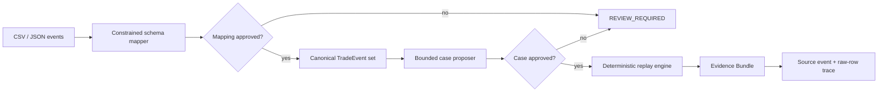

# WeaveTrail Architecture

WeaveTrail separates probabilistic interpretation from authoritative
calculation. A model can narrow ambiguity, but only validated inputs and
versioned code can produce a replay result.

## Component chain



## Trust boundaries

### Interpretation boundary

Provider output is untrusted data. The mapper may select only source columns
that exist and transforms from a fixed allowlist. Invalid shape, low confidence,
unknown columns, or unsupported transforms return `REVIEW_REQUIRED`.

The guided lab executes the server-only fixture provider against a table keyed
by the committed `sourceArtifactHash`. It returns a structured `1.1` proposal
containing each source column, target field, closed transform, confidence,
evidence, and either `PROPOSED` or `REVIEW_REQUIRED`. This proposal is not an
approval. The JSON Lines fixture deliberately leaves `source_note` unmapped,
which demonstrates the review-required path. The API executes this proposal
after request validation and returns `MAPPING_REVIEW_REQUIRED` before replay if
any field needs review; the disabled lab control mirrors that server gate.

### Replay HTTP boundary

`POST /api/replay` accepts a strict object with a committed source-artifact
scenario, one of `baseline`, `shuffle`, or `duplicate`, and an optional non-empty
array of at most four `TradeEvent 1.0` values. Each scenario resolves through an
explicit table to its source artifact, mapping columns, and any committed event
set. The CSV scenario supplies its artifact-derived events when events are
absent. The JSON Lines scenario has no committed event set and its unmapped
`source_note` fails the server mapping gate regardless of whether caller events
are present; it never falls back to CSV-derived evidence. Mutations operate on
the validated selected array, while ordering, duplicate counts, engine version,
and result hashes are always derived on the server.

`NO_COMMITTED_EVENT_SET` is a separate defensive review issue for a scenario
whose mapping fields are all `PROPOSED` but which has neither caller-supplied
events nor a committed event set. No current scenario reaches this branch: the
only scenario without committed events has a `REVIEW_REQUIRED` mapping field
and stops at the earlier mapping gate.

Invalid JSON, contract violations, and canonicalization ambiguity return HTTP
`422` with one body shape: `status: REVIEW_REQUIRED` and a non-empty `issues`
array whose entries carry `code`, `path`, and `message`. Review responses never
contain a replay result or canonical result hash. HTTP `500` remains reserved
for defects outside these declared input failures.

A successful response is also contract-validated and contains only fixture
mode, scenario, mutation, boundary text, engine version, event counts, ordered
event identifiers, and the canonical result hash. The engine's canonical event
objects and their `rawRowHash` provenance remain server-side rather than being
included accidentally through the engine's internal return type.

### Approval boundary

The state machine prevents unapproved output from reaching replay:

```text
UPLOADED -> MAPPING_PROPOSED -> MAPPING_REVIEW_REQUIRED
                           \-> MAPPING_APPROVED -> CASE_PROPOSED
CASE_PROPOSED -> CASE_REVIEW_REQUIRED
             \-> CASE_APPROVED -> REPLAYED -> EXPORTED
```

Any pre-replay state can enter `INPUT_REVIEW_REQUIRED`; resolving the input
conflict restarts at `UPLOADED`. Contracts own this legal transition table and
reject every other transition. Replay requires separate mapping and case
approval records bound to the hashes of their proposed artifacts. A flagged or
non-exact mapping field additionally requires a justified reviewed override.

Canonical events produce a deterministic `DatasetProfile` containing only the
canonical dataset hash, sorted instrument and actor sets, and normalized time
bounds. Case validation cannot widen those facts. Reviewer identity and
approval time remain audit metadata and do not alter the semantic replay hash.

### Decision boundary

The replay engine owns ordering, deduplication, decimal arithmetic, window
aggregation, rule evaluation, counterfactual comparison, and canonical hashes.
It never executes code written by a model.

### Evidence boundary

Canonical hashes exclude volatile metadata. Findings refer to canonical
`eventId` values, and those events retain `sourceEventId` and `rawRowHash` so a
reviewer can reach the source row. The committed synthetic fixtures derive
those identifiers from exact source-artifact bytes and raw rows rather than
hand-authored placeholders.

## Package boundaries

| Package         | Owns                                                            | Must not own                             |
| --------------- | --------------------------------------------------------------- | ---------------------------------------- |
| `contracts`     | Versioned schemas and closed vocabularies                       | Provider calls or verdict logic          |
| `ai-harness`    | Provider adapters, structured proposals, deterministic fixtures | Final calculations or automatic approval |
| `replay-engine` | Canonicalization, rules, hashes, evidence assembly              | Free-form inference or legal conclusions |
| `scenarios`     | Synthetic datasets and mutations                                | Production or personal data              |
| `evals`         | Versioned cases and measurement aggregation                     | Undocumented benchmark claims            |
| `web`           | Human review flow and export surface                            | A second implementation of replay logic  |

## Determinism contract

For one validated dataset and approved manifest:

- source times normalize to fixed-width UTC nanoseconds before comparison and
  hashing;
- canonical event order is normalized `eventTime -> sequence -> eventId` using
  locale-independent UTF-16 code-unit ordering for string tie-breakers;
- equivalent `Z` and explicit-offset representations normalize to the same
  event time;
- a dataset that mixes present and absent sequence values fails closed before
  replay;
- exact duplicates do not alter the result;
- conflicting duplicates fail closed rather than being silently selected, and
  multiple conflicts are reported in canonical source-identity order;
- after exact duplicate collapse, canonical `eventId` values are unique across
  source identities or replay fails with `CONFLICTING_EVENT_IDENTIFIER` before
  ordering and hashing;
- canonical hashes cover an explicit semantic event projection and exclude
  collection metadata (`receivedAt` and `rawRowHash`);
- equivalent approved CSV and JSON Lines dialects converge to the same
  `canonicalDatasetHash` and replay result while retaining distinct artifact
  and row hashes;
- decimal values are never calculated with JavaScript floating point;
- reruns produce the same `canonicalResultHash`.

Fixed-precision time normalization, locale-independent ordering, mixed-sequence
rejection, every permutation of the committed four-event fixture,
conflict-safe duplicate handling, canonical identifier uniqueness and conflict
selection, the canonical event projection, and a committed literal golden hash
have tests today.
Source-artifact, raw-row, event-ID, canonical-dataset and dataset-profile
derivation, profile-bounded cases, workflow transitions, and approval-gated
replay also have committed tests today. Financial arithmetic remains planned.
See
[ADR 0003](adr/0003-use-nanosecond-utc-and-code-unit-ordering.md) for the exact
time representation and input limits, and
[ADR 0004](adr/0004-protect-semantic-events-and-reject-identity-conflicts.md) for
identity and projection scope.

## Provenance contract migration

Hash names identify one boundary rather than relying on context. Mapping
proposal `1.1` uses `sourceArtifactHash`; case manifest `1.1` and Evidence
Bundle `1.1` use `canonicalDatasetHash`; bundles additionally list the
`sourceArtifactHash` of every declared artifact. Legacy `datasetHash` fields are
not accepted by the new strict contracts. See
[ADR 0005](adr/0005-derive-source-provenance.md) for derivation and migration
rules.

## Approval contract migration

Case Manifest `1.2` replaces the `1.1` bare approval status with an immutable
approval record, requires at least one actor, and accepts only registered rule
parameters for the declared rule version. Mapping Proposal remains at `1.1`,
but replay now requires a separate mapping approval record bound to its
artifact hash. Older manifests must retain their original version and migrate
explicitly. See
[ADR 0006](adr/0006-enforce-approval-provenance-before-replay.md).

## Deployment boundary

The MVP uses one Next.js application and local workspace packages. Fixture mode
works without an external model or database. Provider adapters run server-side;
browser bundles must never receive provider credentials. A separate replay
service or database is deferred until measured scale or persistence needs
justify it.
