# WeaveTrail Architecture

_[한국어](ARCHITECTURE.ko.md)_

WeaveTrail separates probabilistic interpretation from authoritative
calculation. A model can narrow ambiguity; only validated inputs and versioned
code produce a replay result.

## Entry and Case Replay

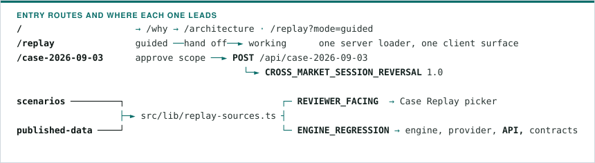

- `packages/scenarios` owns synthetic datasets and controlled mutations;
  `packages/published-data` owns licensed artifacts, provenance, offline
  generated rows and declared mappings, and depends only on contracts. The
  scenario package neither imports nor re-exports published data; the fixture
  provider imports mappings from both owners
  ([ADR 0023](adr/0023-separate-published-data-ownership.md)).
- Catalog metadata marks each committed source `REVIEWER_FACING` or
  `ENGINE_REGRESSION`. The picker lists the grounded set plus only the
  regression fallbacks needed to keep all three result meanings reachable: the
  complete FIX 4.4 case returns `SUPPORTED`, the FIX-shaped missing-side case
  `INCONCLUSIVE`, and a `NOT_SUPPORTED` placeholder stays until a grounded case
  reproduces that meaning. A FIX-shaped identity-conflict source stops at
  `INPUT_REVIEW_REQUIRED` before replay. `/expectations` states each case's
  exact condition, both purposes, its Case Replay availability and whether a
  result hash is produced.
- Metadata also declares the mutations offered per source: published-schema
  synthetic sources and result fallbacks offer `baseline`, `shuffle` and
  `duplicate`; licensed artifacts offer `baseline` and `shuffle` only. No
  control rewrites a committed value, adds a participant or adds a verdict
  ([ADR 0038](adr/0038-separate-reviewer-facing-sources-from-engine-regressions.md),
  [ADR 0039](adr/0039-separate-missing-evidence-abstention-from-conflict-review.md)).
- `/why` states where the gate sits against an existing surveillance pipeline
  and cites its published sources. The overview states position before
  mechanism: surveillance raises a candidate, WeaveTrail confirms the scope,
  re-verifies and opens the evidence, a person decides. It detects nothing.

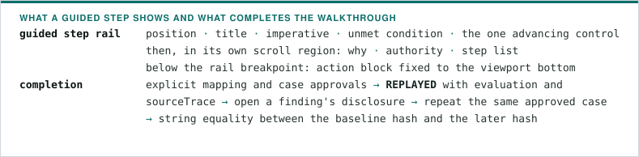

- One navigation entry, `Walk through a case`. `Guided walkthrough` and
  `Working mode` name the two ways to use it and mark the running one. `/replay`
  opens guided; `mode=working` selects working mode; the query is the
  presentation-mode source of truth and carries no trusted approval or result
  state. Re-entering guided mode restores its supported-case baseline and clears
  working input state; refresh starts unapproved.
- A step's control lives in the rail where the step commits something, sharing
  one handler and one disabled state with the case column; where the work
  happens in the case content the rail's control scrolls there and takes focus.
  The step list is navigable for reading, and a step counts as completed only
  while the visitor's own work still satisfies it
  ([ADR 0026](adr/0026-open-guided-steps-with-intent-and-read-ahead.md),
  [ADR 0033](adr/0033-lead-each-guided-step-with-its-action.md)).
- A hash mismatch keeps the original baseline, blocks completion and stays
  retryable. The hand-off exposes working controls without remounting the case
  surface, so in-memory approvals and the result stay valid. Guide progress is
  distinct from the request-local server workflow
  ([ADR 0019](adr/0019-share-guided-and-working-case-replay-state.md)).
- The guided source is `published-execution-fix44.csv` at `baseline`. Its
  mapping chapter embeds the actorless `published-execution-h0stcnt0.jsonl` as a
  separate review example: each instance owns its proposal-specific approval and
  async generation guard, only an example-completion flag crosses into guide
  progress, and the example's approval, source and result never enter the case
  request. The server loader strips committed case approval records before
  sending props.
- Advanced controls permute submitted rows before mapping or duplicate one
  derived event after mapping; original coordinates and values stay unchanged
  ([ADR 0020](adr/0020-prepare-source-order-at-the-caller.md)).

The surface is Korean and English on one set of routes
([ADR 0041](adr/0041-hold-language-selection-outside-react.md)).

- Headlines, section headings and calls to action are written in each language;
  step purposes, gate descriptions, blockers, limitations and disclosures say
  the same things with the same scope and hedging. Neither language may name a
  capability the other omits or present a planned component as working, and
  `apps/web/src/app/i18n/bilingual-parity.test.ts` checks that by shape.
- Contract vocabulary carries one spelling in both. Fixture-mode and
  synthetic-source disclosures sit in the footer, on every page. Korean is set
  in a committed face
  ([ADR 0042](adr/0042-commit-a-korean-face-for-the-korean-surface.md)) and the
  layer diagram is drawn from localized copy
  ([ADR 0043](adr/0043-draw-the-layer-diagram-from-localized-copy.md)).
- `/replay` replaced the former `/lab` route with no alias.

`/case-2026-09-03` is one authored case over committed licensed artifacts: the
KOSPI 200 index and its front-month future on 2026-09-03 against the index's own
2026-07-01 baseline.

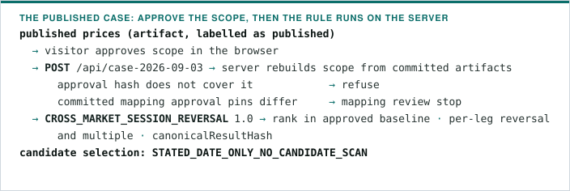

- Nothing the rule produces is shown before the rule runs, and nothing it
  returns is written into page copy: the closing statement is read from the
  returned analysis. The hash is pinned by
  `apps/web/src/lib/published-case.test.ts` and the engine suite.
- The two published field mappings were reviewed once; their approval records,
  approved artifact hash included, are committed in
  `apps/web/src/lib/published-case-approvals.ts`. The page says the mappings
  were reviewed rather than presenting them as the visitor's approval.
- Chart geometry parses every published price to a scaled integer and divides
  once, on the unitless fraction a coordinate needs, so no price reaches binary
  floating point.

## Component chain

![Ten components in two rows: committed source rows are untrusted input; a constrained schema mapper proposes a field mapping; a reviewer approves that proposal bound to its artifact hash; versioned code re-derives the canonical event set and computes a deterministic dataset profile; a planned bounded case proposer would select an actor group and interval from profile facts alone; a reviewer approves the case scope; the deterministic replay engine evaluates the rule; the source trace resolves every finding back to its committed rows; Evidence Bundle assembly and verification recompute the declaration from source bytes. Any gate can refuse, and a refused request carries no result hash](assets/component-chain.svg)

A `PLANNED` component is specified in contracts and tracked as open work rather
than implemented today.

## Trust boundaries

### Published acquisition scopes

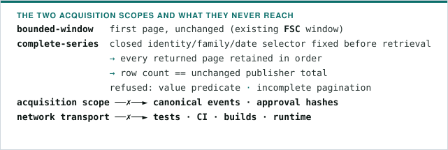

- The manual collector uses reviewed publisher adapters; automated transport
  tests stay synthetic. Offline admission compares committed rows, generated
  source coordinates and requests against the original page bytes.
- See [Published acquisition scopes](PUBLISHED_ACQUISITION.md),
  [ADR 0025](adr/0025-distinguish-published-acquisition-scopes.md) and
  [ADR 0030](adr/0030-declare-published-market-family-and-range-scopes.md).

### Layer boundaries

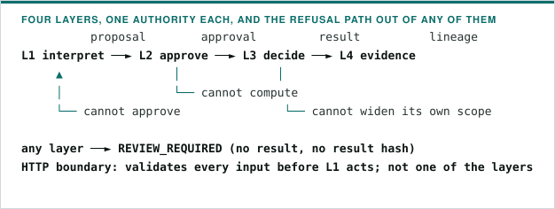

Authority is separated by layer rather than by location. The README states the
model; this document is where each layer's enforcement lives.

| Layer        | Enforced by             | May never                                                       | Leaves behind                                                     |
| ------------ | ----------------------- | --------------------------------------------------------------- | ----------------------------------------------------------------- |
| L1 Interpret | Interpretation boundary | mutate a row, compute a metric, or own a result                 | proposal, per-field evidence, confidence, proposal status         |
| L2 Approve   | Approval boundary       | edit a computed result, or widen the `DatasetProfile` facts     | approval records bound to proposal hashes, justified overrides    |
| L3 Decide    | Decision boundary       | execute model-authored code, or read outside the approved scope | engine and rule version, `canonicalResultHash`                    |
| L4 Evidence  | Evidence boundary       | present a finding whose lineage cannot be resolved              | `eventId`, `rawRowHash`, and the committed source row behind them |

- **No layer holds two authorities.** The proposing layer cannot approve, the
  approving layer cannot compute, the deciding layer cannot widen its scope.
- **A result is true under stated conditions.** Engine version, rule version and
  every threshold compared against travel with the result.

### Interpretation boundary

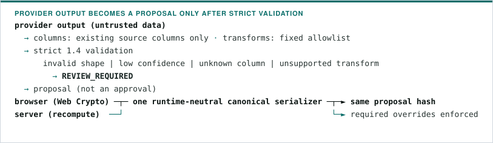

- Case Replay executes the server-only fixture provider against a table keyed by
  committed `sourceArtifactHash`. A `1.4` proposal carries approved dataset and
  venue constants plus each source column, closed target field, transform,
  confidence, evidence and proposal status.
- The surface exposes an explicit local-reviewer action. The browser uses Web
  Crypto only after canonical serialization and fails closed with a visible
  error if either step cannot complete.

### Replay HTTP boundary

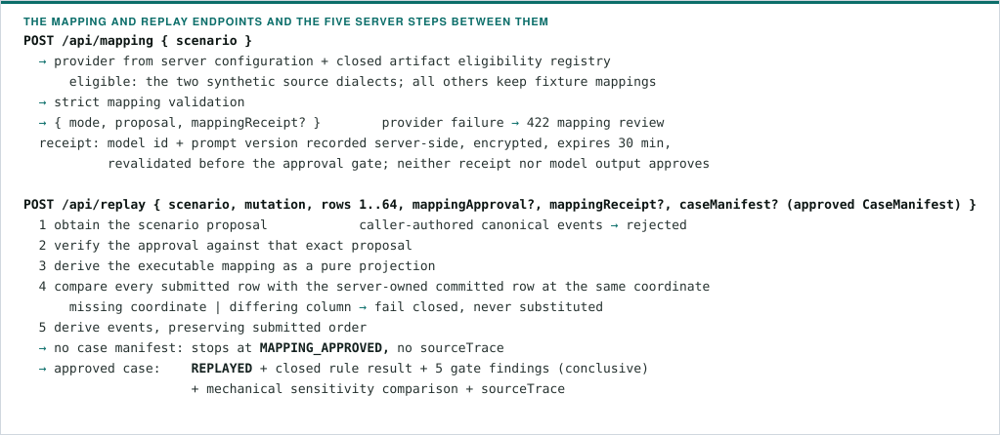

- Page preparation and replay never call the configured provider. Fixture
  clients are unchanged; configured clients request a proposal, approve its
  exact hash, then include `mappingReceipt` in the replay request
  ([ADR 0029](adr/0029-bind-configured-mapping-proposals-to-review.md)).

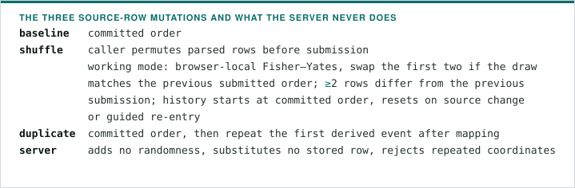

- **Submitted source row order** is read from the same request snapshot; the
  source preview stays in committed order. Explicit same-input repeats resend
  the previous rows without drawing another permutation. Input changes
  invalidate displayed evidence and order, superseded responses cannot restore
  them, and pure reordering retains existing approvals.
- Migration: `shuffle` no longer requests a hidden server-side rotation. Older
  callers sending committed-order `rows` with `shuffle` receive the
  deterministic result for that submitted order
  ([ADR 0020](adr/0020-prepare-source-order-at-the-caller.md)).

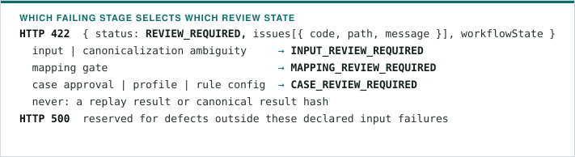

- The failing execution stage selects the state directly; shared issue codes
  such as `APPROVAL_RECORD_REQUIRED` are not reclassified from their strings,
  and the response contract rejects codes incompatible with the selected stage.
- Profile failures use `CANONICAL_DATASET_HASH_MISMATCH`,
  `INSTRUMENT_OUTSIDE_DATASET_PROFILE`, `ACTOR_OUTSIDE_DATASET_PROFILE` or
  `TIME_WINDOW_OUTSIDE_DATASET_PROFILE`; missing rule configuration uses
  `RULE_CONFIGURATION_REQUIRED`.
- Review issue paths are structural arrays relative to the **submitted JSON
  request body**: string segments are literal object keys, number segments are
  zero-based array indices, `["rows", i]` addresses submitted position `i` and
  never the coordinate's `rowNumber`, missing values point to the nearest
  existing parent, and `[]` means the entire body, including when `INVALID_JSON`
  prevents parsing it.

| Failure                                 | Request path                                           |
| --------------------------------------- | ------------------------------------------------------ |
| Changed price in submitted row `i`      | `["rows", i, "values", "px"]`                          |
| Missing actor column in row `i`         | `["rows", i, "values"]`                                |
| Omitted declared row                    | `["rows"]`                                             |
| Foreign artifact in row `i`             | `["rows", i, "coordinate", "sourceArtifactHash"]`      |
| Required mapping override               | `["mappingApproval", "overrides"]`                     |
| Missing mapping approval                | `[]`                                                   |
| Case approval hash mismatch             | `["caseManifest", "approval", "approvedArtifactHash"]` |
| Case `1.3` instrument outside profile   | `["caseManifest", "hypothesis", "instrumentId"]`       |
| Missing or duplicate rule configuration | `["caseManifest", "rules"]`                            |

- Source artifact hashes, row numbers, missing column names and required
  proposal field paths stay diagnostic message context, not path segments.
  Messages are for human review, not a machine-readable protocol.
  Duplicate or conflicting row sets point to `["rows"]`; structural failures in
  the server-owned mapping point to `["mappingApproval"]`.
- **Consumer migration:** use path segments directly against the submitted body.
  Remove row-number lookups, dotted-string splitting, numeric-string coercion
  and handling for the former `fields`/`caseApproval` roots. Multiple missing
  items can share a parent path; retain each issue and message. Approval
  records' `overrides[].fieldPath` keep proposal-relative `fields.n` addresses.
  The response has no version field, and this correction changes no approval
  artifact, engine version, workflow state, HTTP status, verdict or result hash
  ([ADR 0016](adr/0016-use-request-relative-review-paths.md)).

A successful response is contract-validated and carries the actual provider mode
(`fixture` or `ai`), scenario, mutation, boundary text, final `workflowState`,
engine version, event counts, ordered event identifiers and the canonical result
hash.

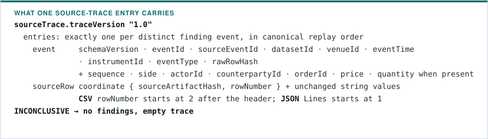

- After approval, source validation and replay succeed,
  `buildFindingSourceTrace` resolves returned canonical events against trusted
  committed rows with `deriveRawRowHash`, which hashes coordinate and values. It
  repeats neither mapping nor rule evaluation. Missing or ambiguous links are
  internal server errors, never partial traces and never a financial
  `INCONCLUSIVE`.
- The existing `scenario` field names the artifact at this single-artifact
  boundary. Internal event arrays stay excluded from `replay.events`;
  `receivedAt` is excluded from the event view, though its unchanged original
  source text may appear in raw column values.
- The Case Replay surface provides a native disclosure per gate, failed gates
  included, with canonical events, hashes, coordinates and source text. The
  browser selects server-resolved entries without deriving evidence; changing
  inputs or approvals clears previous evidence and superseded requests cannot
  replace the current result.

#### Trace response migration

- Strict consumers of successful `REPLAYED` responses must accept the required
  versioned `sourceTrace` member and validate its exact finding-reference set.
  It is not optional on newly produced case responses.
- Foundation and review response shapes are unchanged. The projection and its
  version stay outside `canonicalResultHash` and approval artifacts;
  engine/rule versions, the three rule outcomes and semantic hashes are
  unchanged.
- Trace inspection and engine-package bundle assembly and independent
  verification are implemented; the browser export surface remains planned
  ([ADR 0017](adr/0017-resolve-finding-source-traces-on-the-server.md)).

### Approval boundary

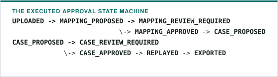

- The route creates a request-local workflow at `UPLOADED` and sends every
  change through the contracts package's `applyTransition`; contracts own the
  legal transition table and reject every other transition, leaving the current
  state unchanged. Any pre-replay state can enter `INPUT_REVIEW_REQUIRED`, and
  resolving the conflict starts a new request and a new workflow at `UPLOADED`.
  Workflows and histories are neither persisted nor correlated across requests
  ([ADR 0014](adr/0014-keep-replay-workflows-request-local.md)).
- Replay requires separate mapping and case approval records bound to the hashes
  of their proposed artifacts. A flagged or non-exact mapping field additionally
  requires a justified reviewed override.

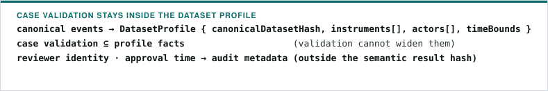

- The direct profile validator reports `1.4` instruments at
  `["hypothesis", "instrumentIds", i]`. An actorless `1.4` hypothesis against a
  profile containing actors reports `["hypothesis", "actorIds"]`, keeping the
  empty declaration's meaning tied to a source that supplies no participant
  identities. These engine-relative paths are not HTTP request paths until a
  request contract opts into the versioned manifest union.

### Decision boundary

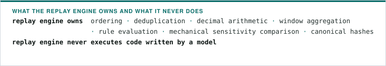

### Evidence boundary

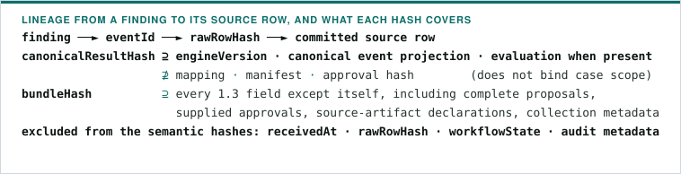

- Findings refer to canonical `eventId` values, and those events retain
  `sourceEventId` and `rawRowHash` so a reviewer reaches the source row. The
  committed synthetic fixtures derive those identifiers from exact
  source-artifact bytes and raw rows rather than hand-authored placeholders.
- Audit metadata can change the enclosing bundle hash without changing the
  semantic result hash.

### Evidence Bundle 1.2 migration

`EvidenceBundleSchema` version `1.2` reuses the strict `sensitivity` object from
the Rapid Price Lift rule result. Version `1.1` inputs, removed fields, mixed
shapes and unknown keys are rejected; there are no aliases, coercion or
automatic converter.

| Old 1.1 path                               | New 1.2 path                                      |
| ------------------------------------------ | ------------------------------------------------- |
| `counterfactual`                           | `sensitivity`                                     |
| `counterfactual.originalPriceChangeBps`    | `sensitivity.priceChangeBps`                      |
| `counterfactual.withoutSuspectedActorsBps` | `sensitivity.priceChangeBpsWithoutApprovedActors` |
| `counterfactual.attributableDifferenceBps` | `sensitivity.removalSensitivityBps`               |

- The new shape requires `bundleVersion: "1.2"` and
  `sensitivity.comparison: "MECHANICAL_METRIC_COMPARISON"`. Metrics keep the
  shared signed decimal-string validation; this change adds no decimal
  normalization or arithmetic check.
- The comparison mechanically removes the approved actor set and reports the
  metric difference. It establishes no attribution, guilt or causation, and
  schema validation establishes shape, not that metrics were recomputed or that
  evidence is authentic.
- Runtime replay behavior is unchanged. The 1.2 contract has no assembler or
  independent verifier and still requires a sensitivity object, while the
  running rule result uses `null` for `INCONCLUSIVE`; the opt-in 1.3 contract
  resolves that mismatch. The contract regressions in
  [`evidence-bundle.test.ts`](../packages/contracts/src/evidence-bundle.test.ts)
  exercise these boundaries with illustrative synthetic inputs.

### Evidence Bundle 1.3 hash scopes

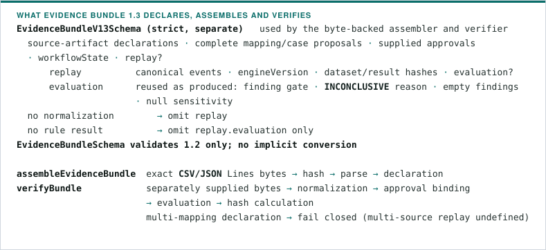

- The original FSC daily quotation artifact ends at `MAPPING_APPROVED` with a
  result hash but no evaluation or case manifest. Bundle `1.3` is defined for
  Event 1.1–1.3, Proposal 1.4–1.8 and Manifest 1.3; hashing converts none of
  them and invents no missing field.
- Verification authenticates neither reviewer nor source publisher and is not a
  signature.
- Normative preimages, the exhaustive protected/excluded field table, canonical
  serialization and migration notes are in
  [Evidence hash scopes](EVIDENCE_HASH_SCOPES.md), decided in
  [ADR 0024](adr/0024-define-evidence-hash-scopes.md). Schema and serialization
  coverage tests enforce their agreement.

## Package boundaries

| Package          | Owns                                                            | Must not own                             |
| ---------------- | --------------------------------------------------------------- | ---------------------------------------- |
| `contracts`      | Versioned schemas and closed vocabularies                       | Provider calls or verdict logic          |
| `ai-harness`     | Provider adapters, structured proposals, deterministic fixtures | Final calculations or automatic approval |
| `replay-engine`  | Canonicalization, rules, hashes, evidence assembly              | Free-form inference or legal conclusions |
| `scenarios`      | Synthetic datasets and controlled mutations                     | Published, production, or personal data  |
| `published-data` | Licensed published artifacts, provenance, and declared mappings | Synthetic mutations or restricted data   |
| `service-store`  | Immutable collected snapshots and derived-result input bindings | Rules, verdicts, or uncollected input    |
| `evals`          | Versioned cases and measurement aggregation                     | Undocumented benchmark claims            |
| `web`            | Human review flow and export surface                            | A second implementation of replay logic  |

### Dependency direction

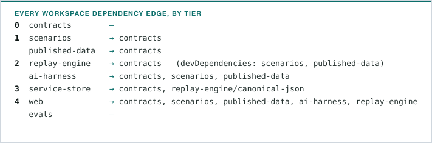

Every workspace edge that exists today. The leading number is the package's
tier, an arrow points from the importer to what it imports, and an em dash means
no workspace dependency. Four rules keep the graph finite as components are
added:

1. **Every edge points down a tier.** No sideways edge, no upward edge, no
   cycle. The workspace manifests and `pnpm typecheck` are the record, and
   nothing imports a path inside another package, only its published entry
   point.
2. **The decision tier receives its inputs as arguments.** Rules, verifiers and
   evidence assembly take rows, registries, calculators and display templates
   from their caller, and resolve no store, URL, clock or provider themselves.
   That is why a new source or storage arrangement cannot reverse an edge.
3. **Storage may not depend on the decision tier.** One edge crosses this line
   today, because the canonical kernel — canonical JSON, hashing, ordering,
   scaled decimals — lives beside the rules and the request workflow.
   `service-store` reaches it through the runtime-neutral
   `@weavetrail/replay-engine/canonical-json` entry, so serialization is all it
   imports and no rule, threshold, hypothesis or verdict type is reachable from
   storage. The manifest edge stays until the kernel has a home of its own
   ([#211](https://github.com/WeaveTrail/WeaveTrail/issues/211)).
4. **Fixtures are test inputs of the decision tier, not runtime inputs.**
   `scenarios` and `published-data` are development dependencies of
   `replay-engine`; `ai-harness` depends on both at runtime because fixture mode
   is a shipped provider, not a test aid.

| Planned component                                                                                                                                                                                                                   | Tier           | May not reach |
| ----------------------------------------------------------------------------------------------------------------------------------------------------------------------------------------------------------------------------------- | -------------- | ------------- |
| Collection ([#179](https://github.com/WeaveTrail/WeaveTrail/issues/179)–[#181](https://github.com/WeaveTrail/WeaveTrail/issues/181))                                                                                                | above storage  | rules         |
| Document parsing ([#182](https://github.com/WeaveTrail/WeaveTrail/issues/182))                                                                                                                                                      | interpretation | storage, web  |
| Event structuring ([#184](https://github.com/WeaveTrail/WeaveTrail/issues/184))                                                                                                                                                     | interpretation | rules         |
| Instrument resolution ([#185](https://github.com/WeaveTrail/WeaveTrail/issues/185))                                                                                                                                                 | interpretation | web           |
| Conclusions ([#186](https://github.com/WeaveTrail/WeaveTrail/issues/186)), feed statistics ([#187](https://github.com/WeaveTrail/WeaveTrail/issues/187)), claim check ([#154](https://github.com/WeaveTrail/WeaveTrail/issues/154)) | decision       | storage       |
| Brief and share link ([#159](https://github.com/WeaveTrail/WeaveTrail/issues/159))                                                                                                                                                  | presentation   | —             |

The application wires a resolved snapshot into a rule; the rule never fetches
one. Which package each planned component lands in is settled in
[#212](https://github.com/WeaveTrail/WeaveTrail/issues/212) before the
collection work starts, so the graph above stays drawable in full.

## Determinism contract

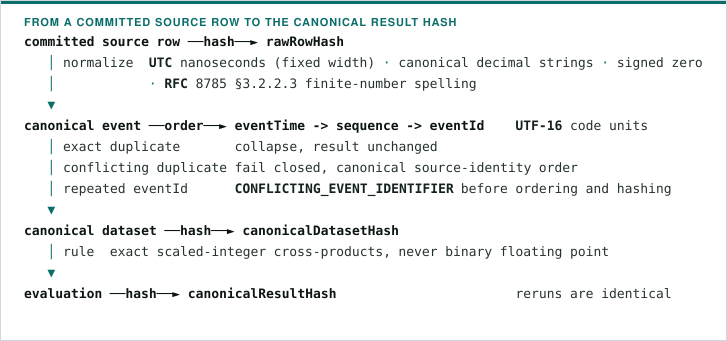

For one validated dataset and approved manifest:

- equivalent `Z` and explicit-offset representations normalize to the same event
  time, and a dataset mixing present and absent sequence values fails closed
  before replay;
- canonical dataset and result hashes cover an explicit semantic event
  projection and exclude collection metadata (`receivedAt`, `rawRowHash`);
- equivalent approved CSV and JSON Lines dialects converge to the same
  `canonicalDatasetHash` and result while retaining distinct artifact and row
  hashes;
- validated price and quantity strings drop insignificant fractional zeroes and
  normalize signed zero before duplicate comparison or hashing;
- finite JSON numbers use one runtime-neutral serializer shared by browser
  approval and server validation;
- `canonicalResultHash` includes engine version and canonical events, plus rule
  result, findings and sensitivity when evaluation occurs, and its preimage
  carries the complete evaluation — finding gates, non-comparable event count,
  any `INCONCLUSIVE` reason — but no mapping, manifest or approval hash, so the
  result hash alone does not bind case scope;
- response `workflowState` is outside the `canonicalResultHash` input.

Both result and bundle hashing sort keys recursively by UTF-16 code unit, omit
undefined properties, reject non-finite numbers, preserve array order and hash
UTF-8 canonical JSON without a trailing newline. No full JCS compliance is
claimed. The engine version remains `0.7.0-canonical-decimal` and existing
literal goldens are unchanged; the complete scope table is in
[Evidence hash scopes](EVIDENCE_HASH_SCOPES.md).

Tested today: fixed-precision time normalization, locale-independent ordering,
mixed-sequence rejection, every permutation of the committed four-event fixture,
conflict-safe duplicates, canonical identifier uniqueness and conflict
selection, canonical decimal spelling, the canonical event projection, a
committed literal golden hash, source-artifact, raw-row, event-ID,
canonical-dataset and dataset-profile derivation, profile-bounded cases,
workflow transitions, approval-gated replay, exact financial arithmetic and the
three declared scenario results. See
[ADR 0003](adr/0003-use-nanosecond-utc-and-code-unit-ordering.md) for time
representation and input limits,
[ADR 0004](adr/0004-protect-semantic-events-and-reject-identity-conflicts.md)
for identity and projection scope, and
[ADR 0009](adr/0009-use-exact-rapid-price-lift-rules-and-explicit-abstention.md)
for the rule formula and abstention boundary.

## Provenance contract migration

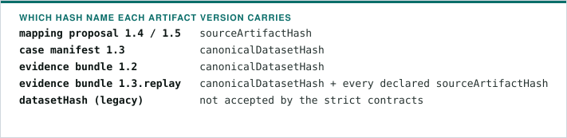

Hash names identify one boundary rather than relying on context. See
[ADR 0005](adr/0005-derive-source-provenance.md) for derivation and migration
rules.

## Approval contract migration

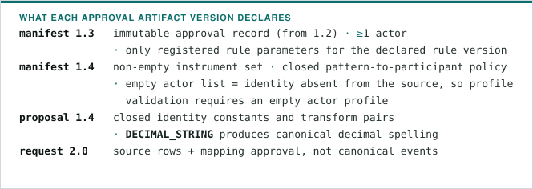

- Existing `1.3` artifacts stay valid without migration; both artifact types use
  the shared RFC 8785 finite-number rule for JSON numbers. Superseded artifacts
  are rejected and require migration and reapproval, and older artifacts retain
  their original version and migrate explicitly.
- See [ADR 0006](adr/0006-enforce-approval-provenance-before-replay.md),
  [ADR 0007](adr/0007-bind-approved-mapping-to-replay.md),
  [ADR 0011](adr/0011-use-rfc-8785-number-serialization.md),
  [ADR 0013](adr/0013-normalize-canonical-decimal-strings.md) for decimal-string
  normalization and its version migration, and
  [ADR 0027](adr/0027-coexist-with-actorless-multi-instrument-manifests.md) for
  manifest coexistence and per-instrument validation.

## Deployment boundary

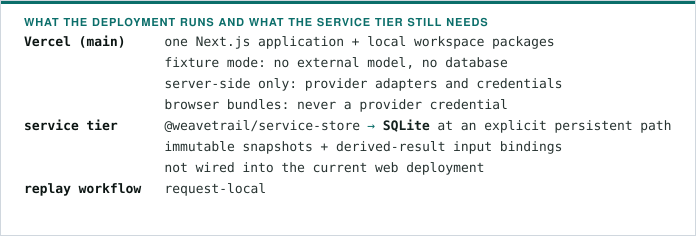

See [ADR 0046](adr/0046-retain-public-sources-in-two-provenance-tiers.md) and
[service snapshot operations](SERVICE_SNAPSHOTS.md).

## Presentation boundary

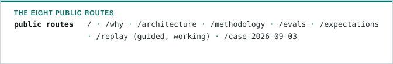

- The eight public routes use a product-local snapshot of the paper-first design
  tokens and the original brand mark, pinned to `WeaveTrail/design-reference`
  revision `3f078da1970e8accd83fbdde73308a2a24d0d1f8`. The design repository is
  neither a build nor a runtime dependency.
- Product copy and every visible evidence value stay owned by this repository's
  runtime responses and committed synthetic scenarios
  ([ADR 0015](adr/0015-apply-the-canonical-design-reference.md)).

## Daily quote and cross-market rule version coexistence

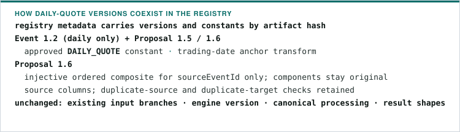

The published FSC KOSPI daily artifact is registered without a case manifest.
See [daily quote normalization](DAILY_QUOTES.md),
[ADR 0022](adr/0022-normalize-daily-quotes-with-version-coexistence.md) and
[ADR 0031](adr/0031-compose-publisher-source-identities-in-mapping-1.6.md).

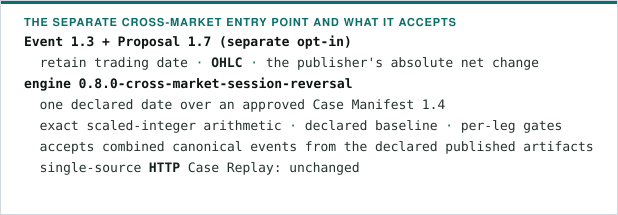

CROSS_MARKET_SESSION_REVERSAL `1.1` is a further opt-in rule contract
([ADR 0032](adr/0032-evaluate-declared-cross-market-session-reversals.md)).

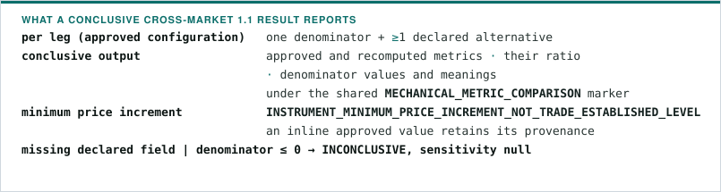

- Version `1.0` stays accepted with its existing engine version and hashes.
  Strict consumers opt into `1.1`, add the denominator declarations to every leg
  and accept the versioned sensitivity branch; no default or conversion is
  provided.
- Selecting another approved denominator changes the Case Manifest approval
  preimage and the canonical engine result, while canonical source events remain
  unchanged
  ([ADR 0035](adr/0035-bind-denominator-substitution-to-the-approved-rule.md)).

## Published execution-schema mapping support

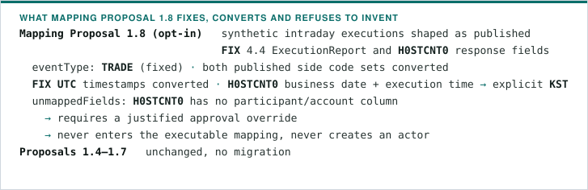

- See
  [ADR 0036](adr/0036-normalize-published-execution-schema-projections.md) and
  the adjacent
  [FIX](../packages/scenarios/src/sources/published-execution-fix44.provenance.json)
  and
  [H0STCNT0](../packages/scenarios/src/sources/published-execution-h0stcnt0.provenance.json)
  source records.
- Every committed replay source has one machine-readable provenance record.
  Synthetic records identify the exact fixture bytes and distinguish
  repository-authored fields from published-schema projections; licensed real
  records retain acquisition, permission and derivation details.
- The display-only `SourceProvenance.recordUrl` reaches that record from the
  source-row panel and stays outside approval and canonical hash inputs. The
  coverage and hash check spans both source-owning packages
  ([ADR 0037](adr/0037-record-every-replay-source-with-adjacent-provenance.md)).
