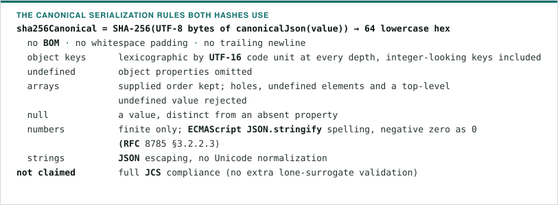
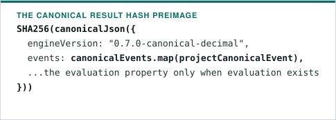
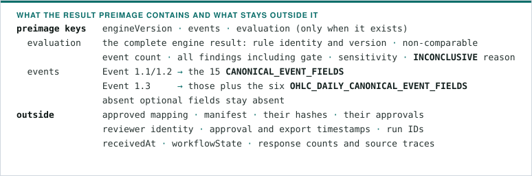
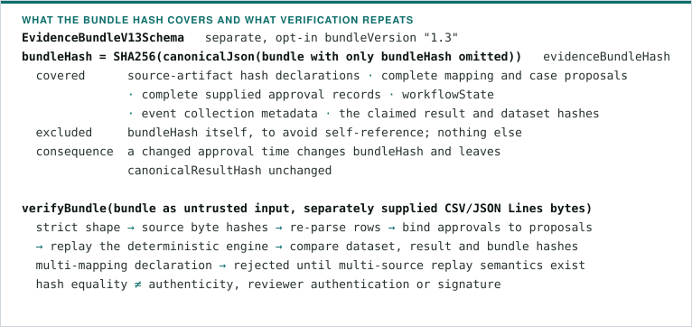
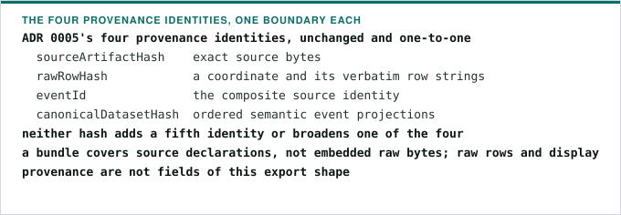
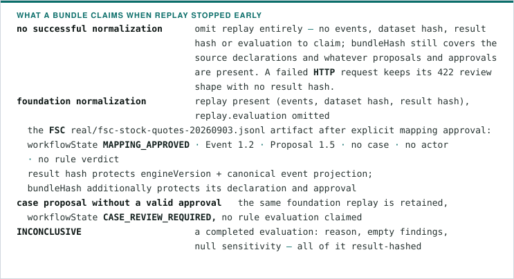
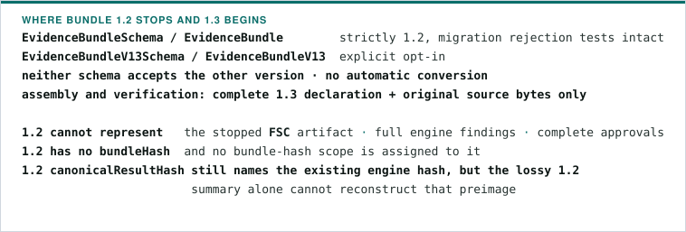
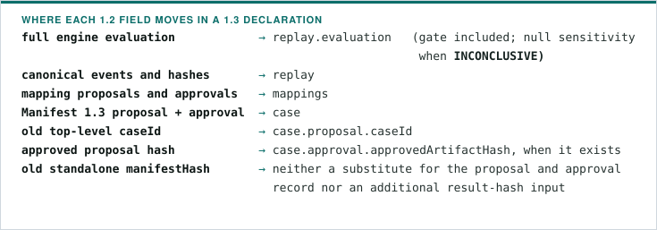

# Evidence hash scopes

This is the published definition used by Evidence Bundle assembly and
independent verification. The contracts, hash primitives, byte-backed
assembler and verifier are implemented in `@weavetrail/replay-engine`. See
[ADR 0024](adr/0024-define-evidence-hash-scopes.md) and
[ADR 0040](adr/0040-verify-evidence-bundles-from-source-bytes.md).

## Canonical serialization

- Prices, quantities, money, rates and thresholds stay decimal strings: the
  serializer neither turns them into numbers nor normalizes their spelling.
- Canonical event validation and normalization — decimal strings, UTC nanosecond
  time, ordering, duplicate handling — happen **before** result hashing.
- Bundle hashing performs none of those steps, reorders no array and neither
  parses nor transforms the declaration: it hashes the supplied contract value.
  `assembleEvidenceBundle` supplies validated canonical events from exact source
  bytes, and `verifyBundle` repeats those steps independently.

## Semantic result

`canonicalResultHash` is exactly the existing `canonicalReplayResultHash`:

- No result is synthesized for normalization alone, and the hash function neither
  sorts nor validates its arguments: callers supply ordered, deduplicated
  canonical events.
- The hash alone does **not bind case scope**, so different scopes producing
  identical events and evaluation can share a result hash. Mapping and manifest
  protection belongs to `bundleHash`.
- This definition narrows ADR 0002's broad wording to the existing
  implementation; it changes no engine bytes and no goldens.

## Bundle declaration

- An omitted approval records absence; it does not mean `APPROVED`. A present
  record carries `approvedArtifactHash`, `reviewerRef`, `decision`, every
  override path and reason, and `approvedAt`, with no audit-field projection.
  Records may describe rejection, and no reviewer or case is invented for an
  unapproved artifact.
- Arrays keep their declared order — mappings, source declarations, overrides —
  with no automatic sorting and no approval-history reconstruction. The current
  workflow persists no audit log.

## Exhaustive 1.3 field table

`P` means included in that hash's preimage; `N` means excluded. Paths use `[]`
for each array element. Object/array containers carry their listed descendants,
including empty arrays; absent optional members contribute nothing. The
`sensitivity` row applies to the null branch, its descendant rows to the object
branch. Result paths below `replay` appear without that wrapper in the result
preimage. Its engine version is the fixed engine constant, not a caller override.
There are no export timestamp or run-ID fields in 1.3; strict validation rejects
unknown fields instead of silently giving them a scope.

<!-- hash-scope-table:start -->

| Field                                                                | canonicalResultHash | bundleHash |
| -------------------------------------------------------------------- | ------------------- | ---------- |
| `bundleVersion`                                                      | N                   | P          |
| `sourceArtifacts[].sourceArtifactHash`                               | N                   | P          |
| `mappings[].proposal.mappingVersion`                                 | N                   | P          |
| `mappings[].proposal.sourceArtifactHash`                             | N                   | P          |
| `mappings[].proposal.constants.schemaVersion`                        | N                   | P          |
| `mappings[].proposal.constants.datasetId`                            | N                   | P          |
| `mappings[].proposal.constants.venueId`                              | N                   | P          |
| `mappings[].proposal.compositeSourceEventId.sourceColumns[]`         | N                   | P          |
| `mappings[].proposal.compositeSourceEventId.transform`               | N                   | P          |
| `mappings[].proposal.compositeSourceEventId.confidence`              | N                   | P          |
| `mappings[].proposal.compositeSourceEventId.evidence`                | N                   | P          |
| `mappings[].proposal.compositeSourceEventId.status`                  | N                   | P          |
| `mappings[].proposal.compositeEventTime.sourceColumns`               | N                   | P          |
| `mappings[].proposal.compositeEventTime.transform`                   | N                   | P          |
| `mappings[].proposal.compositeEventTime.confidence`                  | N                   | P          |
| `mappings[].proposal.compositeEventTime.evidence`                    | N                   | P          |
| `mappings[].proposal.compositeEventTime.status`                      | N                   | P          |
| `mappings[].proposal.constants.eventType`                            | N                   | P          |
| `mappings[].proposal.fields[].sourceColumn`                          | N                   | P          |
| `mappings[].proposal.fields[].targetField`                           | N                   | P          |
| `mappings[].proposal.fields[].transform`                             | N                   | P          |
| `mappings[].proposal.fields[].confidence`                            | N                   | P          |
| `mappings[].proposal.fields[].evidence`                              | N                   | P          |
| `mappings[].proposal.fields[].status`                                | N                   | P          |
| `mappings[].proposal.unmappedFields[].targetField`                   | N                   | P          |
| `mappings[].proposal.unmappedFields[].confidence`                    | N                   | P          |
| `mappings[].proposal.unmappedFields[].evidence`                      | N                   | P          |
| `mappings[].proposal.unmappedFields[].status`                        | N                   | P          |
| `mappings[].approval.approvedArtifactHash`                           | N                   | P          |
| `mappings[].approval.reviewerRef`                                    | N                   | P          |
| `mappings[].approval.decision`                                       | N                   | P          |
| `mappings[].approval.overrides[].fieldPath`                          | N                   | P          |
| `mappings[].approval.overrides[].reason`                             | N                   | P          |
| `mappings[].approval.approvedAt`                                     | N                   | P          |
| `case.proposal.manifestVersion`                                      | N                   | P          |
| `case.proposal.caseId`                                               | N                   | P          |
| `case.proposal.canonicalDatasetHash`                                 | N                   | P          |
| `case.proposal.hypothesis.pattern`                                   | N                   | P          |
| `case.proposal.hypothesis.instrumentId`                              | N                   | P          |
| `case.proposal.hypothesis.actorIds[]`                                | N                   | P          |
| `case.proposal.hypothesis.startTime`                                 | N                   | P          |
| `case.proposal.hypothesis.endTime`                                   | N                   | P          |
| `case.proposal.rules[].ruleId`                                       | N                   | P          |
| `case.proposal.rules[].ruleVersion`                                  | N                   | P          |
| `case.proposal.rules[].parameters.minimumPriceChangeBps`             | N                   | P          |
| `case.proposal.rules[].parameters.minimumAggressiveBuyShareBps`      | N                   | P          |
| `case.proposal.rules[].parameters.minimumActorConcentrationShareBps` | N                   | P          |
| `case.proposal.rules[].parameters.minimumExecutionsAboveReference`   | N                   | P          |
| `case.proposal.rules[].parameters.minimumRemovalSensitivityBps`      | N                   | P          |
| `case.proposal.aiTrace.provider`                                     | N                   | P          |
| `case.proposal.aiTrace.model`                                        | N                   | P          |
| `case.proposal.aiTrace.promptVersion`                                | N                   | P          |
| `case.proposal.aiTrace.confidence`                                   | N                   | P          |
| `case.proposal.aiTrace.referencedEventIds[]`                         | N                   | P          |
| `case.approval.approvedArtifactHash`                                 | N                   | P          |
| `case.approval.reviewerRef`                                          | N                   | P          |
| `case.approval.decision`                                             | N                   | P          |
| `case.approval.overrides[].fieldPath`                                | N                   | P          |
| `case.approval.overrides[].reason`                                   | N                   | P          |
| `case.approval.approvedAt`                                           | N                   | P          |
| `workflowState`                                                      | N                   | P          |
| `replay.engineVersion`                                               | P                   | P          |
| `replay.canonicalDatasetHash`                                        | N                   | P          |
| `replay.events[].schemaVersion`                                      | P                   | P          |
| `replay.events[].eventId`                                            | P                   | P          |
| `replay.events[].sourceEventId`                                      | P                   | P          |
| `replay.events[].datasetId`                                          | P                   | P          |
| `replay.events[].venueId`                                            | P                   | P          |
| `replay.events[].eventTime`                                          | P                   | P          |
| `replay.events[].receivedAt`                                         | N                   | P          |
| `replay.events[].sequence`                                           | P                   | P          |
| `replay.events[].instrumentId`                                       | P                   | P          |
| `replay.events[].eventType`                                          | P                   | P          |
| `replay.events[].side`                                               | P                   | P          |
| `replay.events[].actorId`                                            | P                   | P          |
| `replay.events[].counterpartyId`                                     | P                   | P          |
| `replay.events[].orderId`                                            | P                   | P          |
| `replay.events[].price`                                              | P                   | P          |
| `replay.events[].quantity`                                           | P                   | P          |
| `replay.events[].tradingDate`                                        | P                   | P          |
| `replay.events[].openPrice`                                          | P                   | P          |
| `replay.events[].highPrice`                                          | P                   | P          |
| `replay.events[].lowPrice`                                           | P                   | P          |
| `replay.events[].closePrice`                                         | P                   | P          |
| `replay.events[].netChange`                                          | P                   | P          |
| `replay.events[].rawRowHash`                                         | N                   | P          |
| `replay.evaluation.ruleId`                                           | P                   | P          |
| `replay.evaluation.ruleVersion`                                      | P                   | P          |
| `replay.evaluation.nonComparableEventCount`                          | P                   | P          |
| `replay.evaluation.result`                                           | P                   | P          |
| `replay.evaluation.reason`                                           | P                   | P          |
| `replay.evaluation.findings[].gate`                                  | P                   | P          |
| `replay.evaluation.findings[].ruleId`                                | P                   | P          |
| `replay.evaluation.findings[].observedValue`                         | P                   | P          |
| `replay.evaluation.findings[].threshold`                             | P                   | P          |
| `replay.evaluation.findings[].passed`                                | P                   | P          |
| `replay.evaluation.findings[].referencedEventIds[]`                  | P                   | P          |
| `replay.evaluation.sensitivity`                                      | P                   | P          |
| `replay.evaluation.sensitivity.comparison`                           | P                   | P          |
| `replay.evaluation.sensitivity.priceChangeBps`                       | P                   | P          |
| `replay.evaluation.sensitivity.priceChangeBpsWithoutApprovedActors`  | P                   | P          |
| `replay.evaluation.sensitivity.removalSensitivityBps`                | P                   | P          |
| `replay.canonicalResultHash`                                         | N                   | P          |
| `bundleHash`                                                         | N                   | N          |

<!-- hash-scope-table:end -->

The schema/table exhaustiveness test traverses every version/union branch,
including optional fields. Serialization tests independently project values
using this table and compare both production hash functions with those
preimages. Field mutation probes exercise inclusion and exclusion; editing a
scope or adding an undocumented field fails CI.

## Stopped artifacts and version coexistence

- Event 1.1 and 1.2 use the original 15-field projection; Event 1.3 adds its six
  OHLC daily fields to that protected projection. Absent optional fields are
  never filled in and hashing converts no event version.
- Proposals 1.4 through 1.8 are covered in full by `bundleHash` and never
  directly by the result hash, composite source identity, composite event time
  and explicit unmapped-field declarations included.
- Manifest 1.3 is stored as its complete proposal plus the separate, optional
  approval record; its case identity, hypothesis, rule parameters and AI trace
  are bundle-only inputs.
- One definition therefore covers every committed single-source replay artifact
  without version upgrades or invented source attributes.

## Bundle 1.2 compatibility

The field table above describes 1.3 fields only. Migration needs the original
artifacts and engine output:

Do not recover missing events, approvals, gates or abstention reasons by
inventing them from a 1.2 summary.
