# Published acquisition scopes

Every committed real artifact declares one of two acquisition scopes beside its
provenance. Both require permission to commit, modify and redistribute the data,
verified manually on the acquisition date.

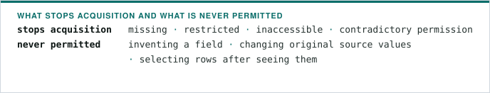

| Scope             | Selection guarantee                                                                | Completion evidence                                                                        |
| ----------------- | ---------------------------------------------------------------------------------- | ------------------------------------------------------------------------------------------ |
| `bounded-window`  | A small first-page window, fixed before inspecting values                          | The existing provider-specific window checks; this is not the whole series                 |
| `complete-series` | Every row returned for one predeclared identity, family and date scope is retained | Consecutive pages, an unchanged publisher total, and derived row count equal to that total |

- Use the bounded window for a deliberately limited normalization example, and a
  complete series when the declared source exceeds that window and completeness
  is the intended guarantee.
- Raising the bounded-window ceiling, or trimming a complete series to it, is not
  a migration between the scopes.

## Existing artifact

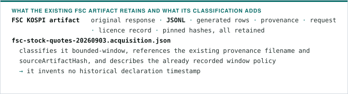

Its manual acquisition and offline derivation commands stay in the
[source README](../packages/published-data/src/sources/real/README.md).

## Complete-series declaration

`validateCompleteSeriesDeclaration` in `scripts/complete-series.mjs` accepts a
strict declaration:

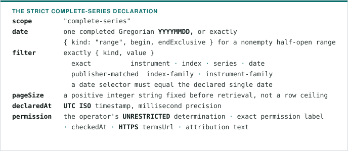

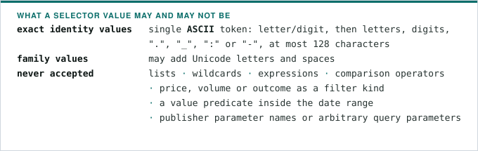

Permission checking stays manual: validating the record establishes neither legal
permission nor the operator's timestamp.

## Manual retrieval API and adapter boundary

`retrieveCompleteSeries({ declaration, output }, adapter)` in
`scripts/retrieve-complete-series.mjs` is a manual library entry point with no
default endpoint, transport or credentials.

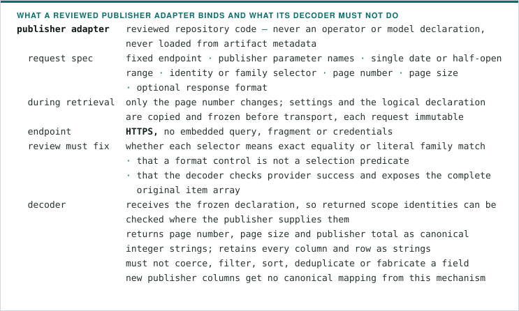

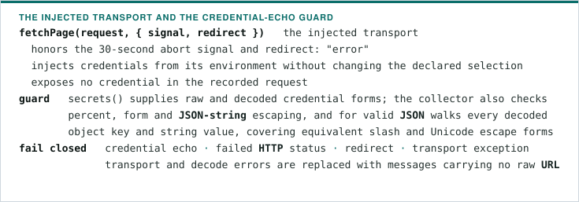

- The reviewed Financial Services Commission adapters bind only the official
  `getStockMarketIndex`, `getStockFuturesPriceInfo` and `getOptionsPriceInfo`
  operations. Their exact index selector binds `idxNm`; family selectors bind the
  documented `likeIdxNm` and `likeItmsNm` literal-inclusion parameters. Their
  decoders require provider success, the complete operation-specific column set,
  the declared date and family scope, and nonduplicated publisher identities.
- Imports read no credentials and make no request. The manual transport reads
  `DATA_GO_KR_SERVICE_KEY` inside the process and adds it only to the outgoing
  request.

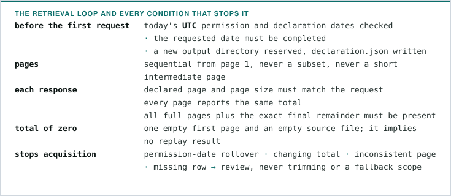

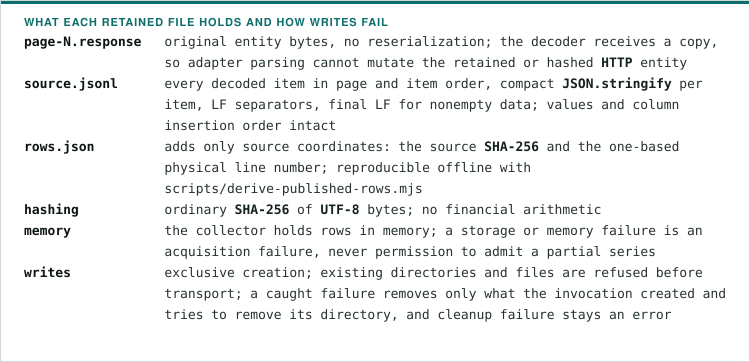

Successful evidence is never overwritten. This is exception recovery, not
crash-atomic persistence: abrupt termination or storage failure can leave an
incomplete directory that needs inspection.

## Recorded evidence and offline admission

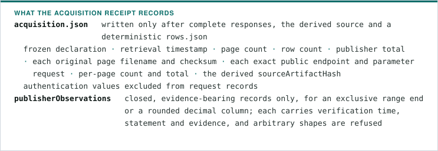

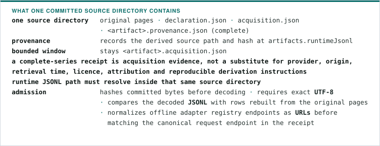

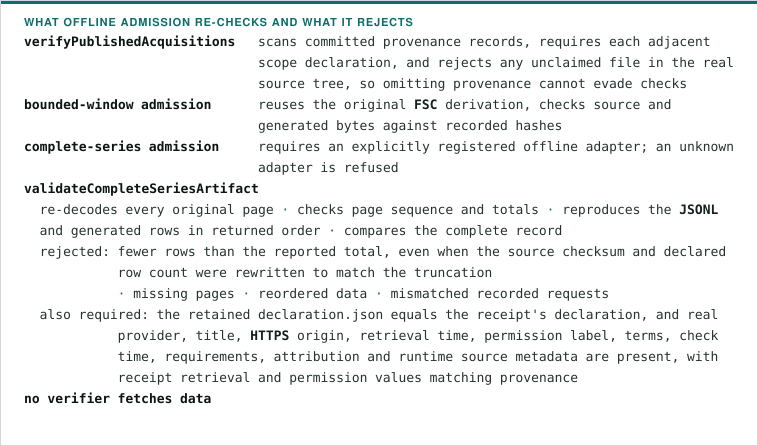

The committed inventory check runs in `pnpm test`. A future complete-series
artifact must add its reviewed decoder to that check's adapter registry; until
then complete-series admission fails closed. Transport tests use only synthetic
responses and a synthetic protocol, never a recording of a publisher. Reproduce:

```bash
pnpm exec vitest run packages/published-data/src/acquisition-scope.test.ts packages/replay-engine/src/daily-quote-derivation.test.ts packages/replay-engine/src/real-market-data.test.ts
```

## Hash and ownership boundary

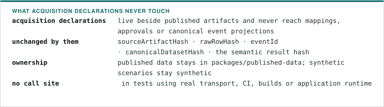

Completeness here means equality with the publisher-reported total for the
declared scope. It is not evidence of authenticity, a stable remote snapshot,
coverage outside that scope, or a rule verdict, and the count cannot compensate
for a publisher whose totals or selector semantics cannot be trusted. See
[ADR 0025](adr/0025-distinguish-published-acquisition-scopes.md) and
[ADR 0030](adr/0030-declare-published-market-family-and-range-scopes.md).
