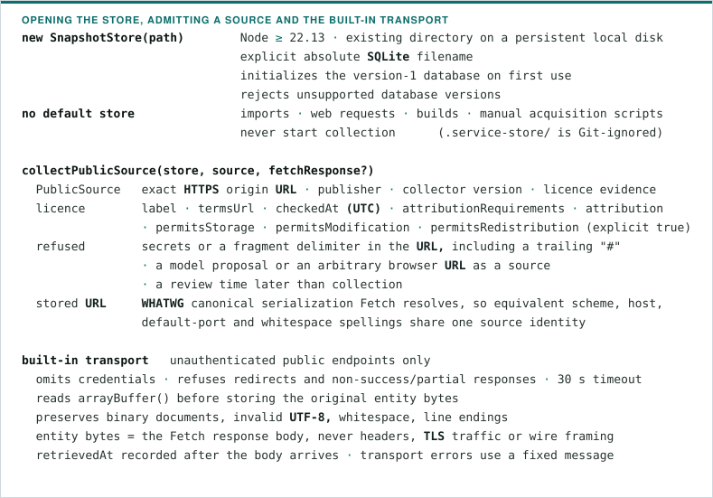
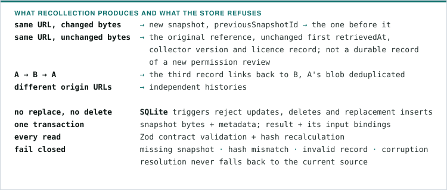
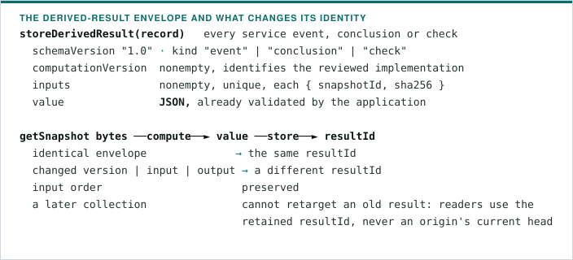
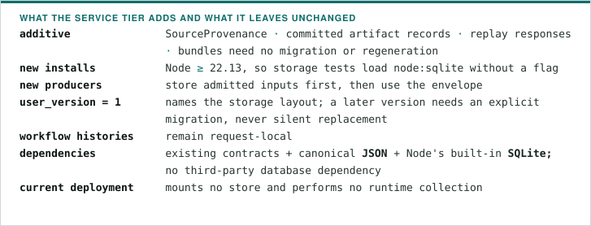
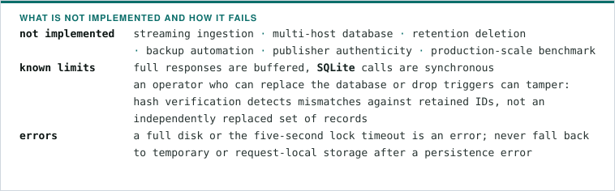

# Service snapshot operations

`@weavetrail/service-store` is the second provenance tier, for collected public
documents and data responses. The committed verification tier stays in
`packages/published-data` and `packages/scenarios` with its existing admission
checks, goldens and hashes
([ADR 0046](adr/0046-retain-public-sources-in-two-provenance-tiers.md)).

## Storage and collection



- An operator must review the actual terms; the licence assertions are not
  automatic verification. There is no pasted-text input and no upload
  persistence call site.
- Reviewed authenticated collectors may call
  `storeSnapshot(bytes, { source, retrievedAt })` after enforcing their own
  credential-echo and source-admission guards. Existing verification collectors
  keep saving their original response files and receipts; their outputs are not
  imported automatically, and this tier retrieves and commits no additional real
  source.

## Identities and immutable records

| Identity     | Coverage                                                                      | Resolution                                                                            |
| ------------ | ----------------------------------------------------------------------------- | ------------------------------------------------------------------------------------- |
| `sha256`     | Exact original entity bytes                                                   | Verified when reading a snapshot                                                      |
| `snapshotId` | Canonical `ServiceSnapshot` 1.0 metadata, including byte hash and predecessor | `getSnapshot(snapshotId)` returns metadata and verified bytes                         |
| `resultId`   | Canonical `ServiceDerivedResult` 1.0 envelope                                 | `resolveDerivedResult(resultId)` returns the result and every verified original input |



Snapshot metadata is `schemaVersion`, `source`, UTC `retrievedAt`, `sha256` and
nullable `previousSnapshotId`; all hashes are lowercase hexadecimal SHA-256.
Call `close()` when finished.

## Derived results



- Domain contracts and approvals are enforced by the application before
  insertion. Persist every input dependency, including separately collected
  supporting documents: the store cannot infer an omitted input or judge what a
  computation-version label means. Financial decimals stay strings, and no
  function executes generated code or treats a model's text as an approved
  result.
- Inputs are checked before insertion and again on resolution.
- The envelope is separate from canonical replay and Evidence Bundle 1.3. It
  changes neither contract nor hash, establishes no approval, signs nothing and
  authenticates no publisher. Retrieval timestamps affect snapshot identity, not
  engine result hashes.
- Public event pages and share-link HTTP routes over these IDs are not
  implemented.

## Migration and deployment



For an actual collector: provision a persistent local volume with restricted
filesystem access and backups, outside Git and public asset directories; use a
consistent SQLite backup, or stop all writers and close connections before
copying; retain result IDs outside the database where independent integrity
comparison is required.



## Reproducible verification

```bash
pnpm exec vitest run packages/service-store/src/snapshot-store.test.ts
```

Synthetic on-disk storage and transport tests cover byte preservation and
re-hashing after reopening, single-byte and metadata corruption, unchanged and
changed recollection, A → B → A lineage, cross-origin blob deduplication,
separate connections, atomic rollback, immutable tables, result-version and
input bindings, and transport and admission failures. No live publisher or
credential is used. `pnpm test` also runs the committed-artifact and golden
suites without updating their snapshots.
